# GraphicsEngine
The implementation of "RayTracing, RealTime Rendering, Rasterization Rendering" 

## Implementation of 《Ray Tracing In One Weekend》
### Chapter-01

---
使用了一个图像处理库，"stb_image_write.h",
大概操作如下：
```cpp
// 申请一块连续的内存用来存储像素
auto* data = (unsigned char*)malloc(width * height * channel);

// To do...

// 写入图像
stbi_write_png("output-chapter01.png", width, height, channel, data, 0);

// 释放内存
stbi_image_free(data);
```
### Chapter-02
这一章节主要是构建一些基元用以构建整个图形学的世界，主要就是向量类，这里我没有根据 **Ray Tracing In One Weekend** 的思想来，而是直接迁移了 **PBRT** 一书中有关 **Vector, Point, Normal** 的实现，具体可参见 [pbrt.org](https://www.pbrt.org/)

相比于上一章，主要是用 Vector 来承载RGB颜色并输出。

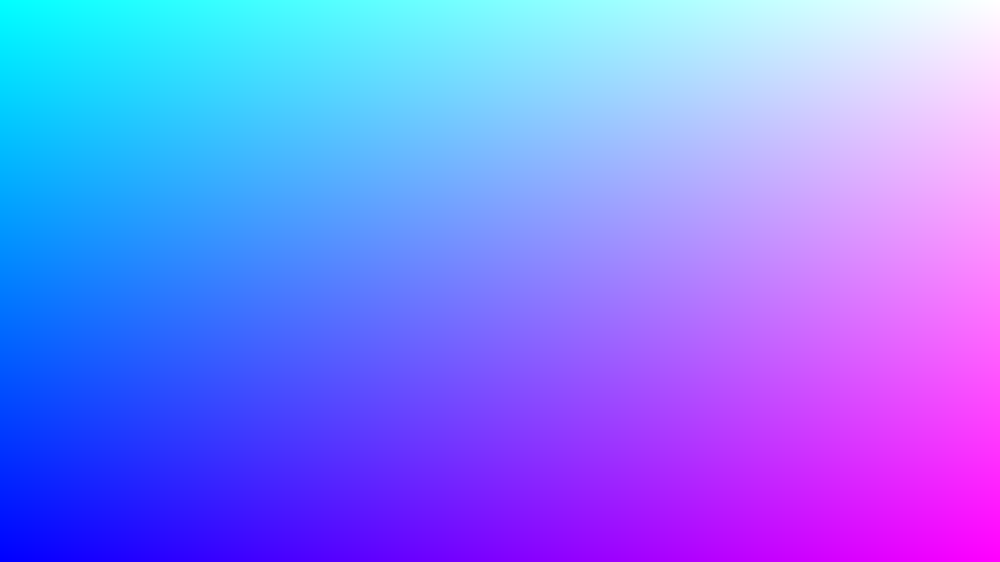
### Chapter-03
设计一个简单的光线类(Ray)，同时用简单的方式来测试光线的值，转化为一种简便的颜色，可以用来当作背景。这里因为看过pbrt，再加上后面也会以此为基础添加更多的功能，因此直接将pbrt中的光线类代码搬了过来使用。毕竟有更好的轮胎🤣

使用不同分量来插值以得到不同的视觉感受
```cpp
// Chapter03 : simple color function
Point3f Color(const Ray& ray) {
	Vector3f dir = Normalize(ray.d);
	Float t = 0.5 * (dir.y + 1.0);
	return Lerp(t, Point3f(1.0, 1.0, 1.0), Point3f(0.5, 0.7, 1.0));
}
```

我分别测试了三种分量来获得不同的效果。

---
$$t=0.5\times(\mathbf{dir}_y + 1.0)$$

 

---
$$t=0.25\times(\mathbf{dir}_x + 2.0)$$

 

---
 $$t=\mathbf{dir}_z + 2.0$$

 

至于 $t$ 为什么要这么计算，目的主要是为了将其区间映射至 $[0,1]$ .

### Chapter-04
利用球体的公式来绘制球，通常来说，图形学里绘制几何有两种方式，分别是隐式和显式，凡是有公式的都属于前者，后者则是直接提供构成曲面的顶点。

这里我的代码和书中稍微有点不一样，主要为了实现距离对其颜色的影响，让其在远近上颜色有一定的过渡。

```cpp
static Point3f sphereCenter(0, 0, -1); // 设置圆的中心
static Float sphereRadius = 0.5; // 设置圆的半径

// Chapter04 : simple sphere
bool HitSphere(const Point3f& center, Float radius, const Ray& ray, Float& t) {
	Vector3f oc = ray.o - center;
	Float a = Dot(ray.d, ray.d);
	Float b = 2.0 * Dot(oc, ray.d);
	Float c = Dot(oc, oc) - radius * radius;
	Float discriminant = b * b - 4 * a * c;
	// 判断有根与否并求根，取小的根作为击中点所需要的时间(可以把t抽象成时间)
	if (discriminant > 0) {
		Float invA = 1.0 / (2.0 * a);
		Float t0 = (-b + sqrt(discriminant)) * invA;
		Float t1 = (-b - sqrt(discriminant)) * invA;
		t = min(t0, t1);
		return true;
	}
	return false;
}

// Chapter03-04 : simple color function
Point3f Color(const Ray& ray) {
	Float t;
	if (HitSphere(sphereCenter, sphereRadius, ray, t)) {
		t = exp(-t); // 将 t 映射至 (0, 1] 以此获得远近颜色过渡的效果
		return Lerp(t, Point3f(0.2, 0.2, 0.2), Point3f(0.6, 0.4, 0.5));
	}
	// 没击中就画个背景
	Vector3f dir = Normalize(ray.d);
	t = 0.5 * (dir.y + 1.0);
	return Lerp(t, Point3f(1.0, 1.0, 1.0), Point3f(0.5, 0.7, 1.0));
}
```

效果图：

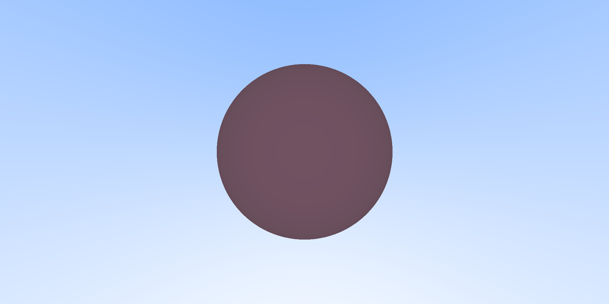

### Chapter-05
本章主要引入了法线的概念，并且简单实现了球体的法线。在图形学中法线是必不可少的一个概念，后面不管是任何的渲染公式都会用到，包括后面的 **半程向量(halfDir)，视角向量(viewDir)** 都是重要的概念。

本节主要将球体的法线可视化出来，这里是相当于直接使用世界坐标轴下的法线向量输出成rgb，相对来说还没有涉及到在**切线空间**下的表示，后面会慢慢加入这些功能。另外将这些几何体抽象成一个单独的类，目前还只有球的表示，后面应该会结合 **pbrt** 中的几何章节加入不同的几何体表示。

**法线可视化**：

```cpp
// Chapter03-04 : simple color function
Point3f Color(const Ray& ray) {
	Float t;
	if (HitSphere(sphereCenter, sphereRadius, ray, t)) {
		// Chapter-05:击中就求其击中点的法线，球的法线直接就是击中点连接球中心的交点
		Vector3f N = Normalize(ray(t) - sphereCenter); 
		Vector3f normalColor = (N + Vector3f(1.0, 1.0, 1.0)) * 0.5;
		return Point3f(normalColor.x, normalColor.y, normalColor.z);
	}
	// 没击中就画个背景
	Vector3f dir = Normalize(ray.d);
	t = 0.5 * (dir.y + 1.0);
	return Lerp(t, Point3f(1.0, 1.0, 1.0), Point3f(0.5, 0.7, 1.0));
}
```


这里解释一下为什么会出现这样的效果，设置法线表示 $\mathbf{N}$ .
首先从世界坐标的角度去理解，朝屏幕上方的 $\mathbf{N} \to [0.0,1.0,0.0]$，故其颜色分量 $rgb \to [0.0,1.0,0.0]$，因此造成朝上的方向会更绿，原因就是其 $green$ 分量的值更大；同理屏幕左边和右边也可以这样去理解。

**抽象类**：
通过 **Shape** 作为基类，派生出 **Sphere, ShapeList** 类，其中我自己实现的方式和书中有一些不同，比如命名方式，以及使用了智能指针和vector容器来实现 **ShapeList** 。

最终实现本节的两个球体效果。

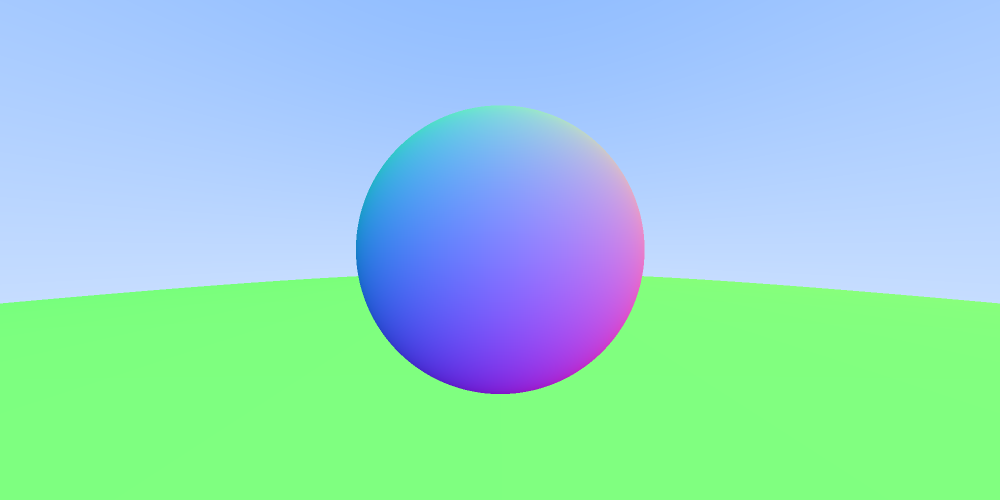

**纠正代码：**
 ```cpp
 for (int sy = height - 1; sy >= 0; sy--)
{
	for (int sx = 0; sx < width; sx++)
	{
		Float u = Float(sx) / Float(width);
		Float v = Float(height - sy - 1) / Float(height);
		
		Ray ray(origin, lowerLeftCorner + u * horizontal + v * vertical);
		
		Point3f color = Color(ray, world);
		
		int ir = int(255.99 * color[0]);
		int ig = int(255.99 * color[1]);
		int ib = int(255.99 * color[2]);
		
		int shadingPoint = (sy * width + sx) * 3;
		data[shadingPoint] = ir;
		data[shadingPoint + 1] = ig;
		data[shadingPoint + 2] = ib;
	}
}
 ```
 前面使用按照书中的方式，但是计算 **v** 感觉有点违背直觉，因此我将计算的结果与视角相联系了起来，修改了 **v, shadingPoint** 的计算过程。

 ### Chapter-06
 本章主要是将摄像机抽象成了一个类，毕竟现代编程，OOP(面向对象)是一个基本的常识。此外引入了采样数量的概念，主要是用来抗锯齿，本章中实现的效果相当于 **SSAA** ，效果很好，但是太费时了。这里先给自己定些小目标！后面自己去实现 **MSAA** 等抗锯齿技术，

具体代码和书中大同小异，就不在本文中细述了。主要看其效果：

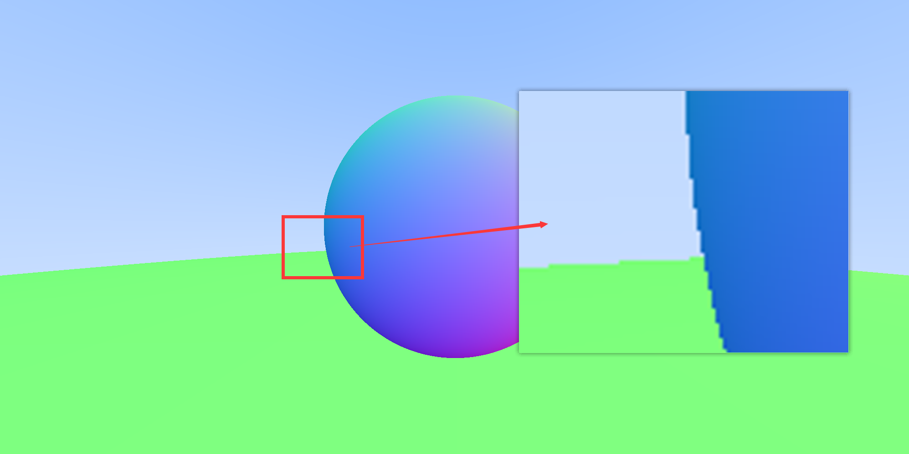

$$spp=1,time=4271ms$$

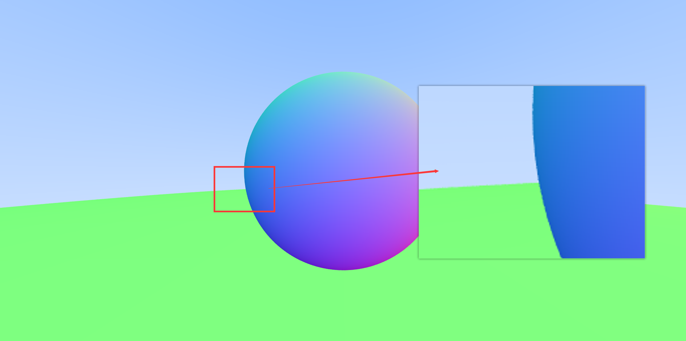

$$spp=16,time=59097ms$$

可以看出，渲染时间几乎是以 **spp** 的倍数增长。后面测试就需要调低分辨率了，这里设置的都是 $2000\times 1000$ 。

### Chapter-07
本章实现了一下 **Diffuse** 的材质，这里实现的非常简洁，并且都没有涉及到光源，材质的颜色也没有涉及到，纯粹是通过判断光线与物体是否有交点，有就返回其多次弹射到背景上的颜色，并且每次弹射颜色都会衰减一半，这就会出现下图中的情况。

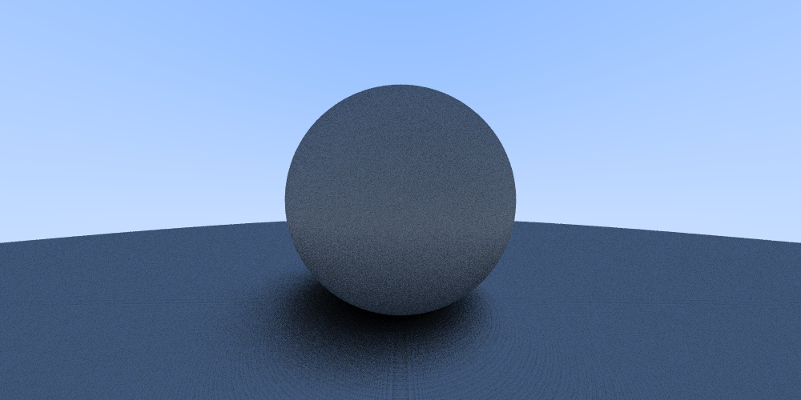

可以看到两球靠近的地方会更加容易使光线弹射多次，这就造成采样到的颜色值不断衰减，形成了阴影般的效果。

另外由于显示器都会默认颜色值是经过 **gamma矫正**的，但实际上我们获得的颜色值并未矫正，造成其效果会偏暗，但实际上我感觉生成出来也不像书上那么暗。为了以结果来证明，修改代码以矫正颜色，这里我采用的就是比较准确的伽马矫正，与书中有些微差别。

```cpp
void Renderer(const char* savePath) {
	// 参数设置
	int width = 1000, height = 500, channel = 3;
	Float gamma = 1.0 / 2.2;


	// 采样值，一个像素内采多少次样
	int spp = 4;
	Float invSpp = 1.0 / Float(spp);

	auto* data = (unsigned char*)malloc(width * height * channel);

	// 构建一个简单的相机
	Camera camera;

	// 搭建一个简单的场景
	vector<std::shared_ptr<Shape>> shapes;
	shapes.push_back(CreateSphereShape(Point3f(0, 0, -1), 0.5));
	shapes.push_back(CreateSphereShape(Point3f(0, -100.5, -1), 100));

	// 构建随机数
	// std::default_random_engine seeds;
	// seeds.seed(time(0));
	std::uniform_real_distribution<Float> randomNum(0, 1); // 左闭右闭区间


	std::shared_ptr<Shape> world = CreateShapeList(shapes);
	for (auto sy = height - 1; sy >= 0; sy--) {
		for (auto sx = 0; sx < width; sx++) {
			Point3f color;
			// 采样计算
			for (auto s = 0; s < spp; s++) {
				Float u = Float(sx + randomNum(seeds)) / Float(width);
				Float v = Float(height - sy - 1 + randomNum(seeds)) / Float(height);
				Ray ray = camera.GenerateRay(u, v);
				color += Color(ray, world);
			}
			color *= invSpp; // 求平均值
			color = Point3f(pow(color.x, gamma), pow(color.y, gamma), pow(color.z, gamma)); // gamma矫正
			int ir = int(255.99 * color[0]);
			int ig = int(255.99 * color[1]);
			int ib = int(255.99 * color[2]);

			int shadingPoint = (sy * width + sx) * 3;
			data[shadingPoint] = ir;
			data[shadingPoint + 1] = ig;
			data[shadingPoint + 2] = ib;
		}
	}
	// 写入图像
	stbi_write_png(savePath, width, height, channel, data, 0);
	cout << "渲染完成！" << endl;
	stbi_image_free(data);
}
```

确实要亮些了，果然什么都得实践！！！

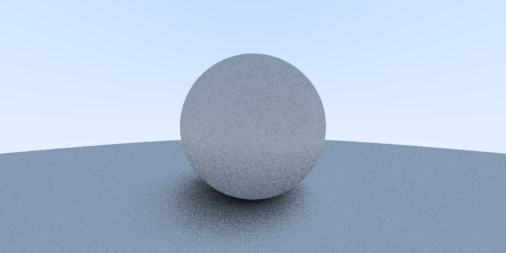


### Chapter-08
本节主要实现了金属材质的模拟，这里主要去把金属当作镜子来理解。不同材质的实现主要靠改变反射光的分布。因此光线击中金属表面后反射的光近似于镜面反射，因此在材质中实现了 **Reflect** 方法。此外并不是所有金属表面都是纯镜面反射的，因此添加了一个参数 $fuzz$ 用来扰动反射光，达到那种反射情况介于镜面反射和漫反射之间的材质，我们称为 **Glossy material**。它不是完全的镜子，比镜子粗糙一些，就像铜镜。

---

这里给自己提个醒，看来C++掌握的还不太熟练，头文件的引用造成在写这一节的代码的时候出现了很多低级错误。不过这也算是一个学习的过程，知难而上😆，主要结合了pbrt的代码来写的，并不完全是照着这本书来写。另一个需要注意的是**随机数**的使用，切记要使用同一分布的随机数，不然出来的图片噪音很明显，且分布很不自然。

---

接下来就该展现成果图了，虽然渲染时间长一点，但还是会花久一点得到更好看的结果来奖励自己。。。

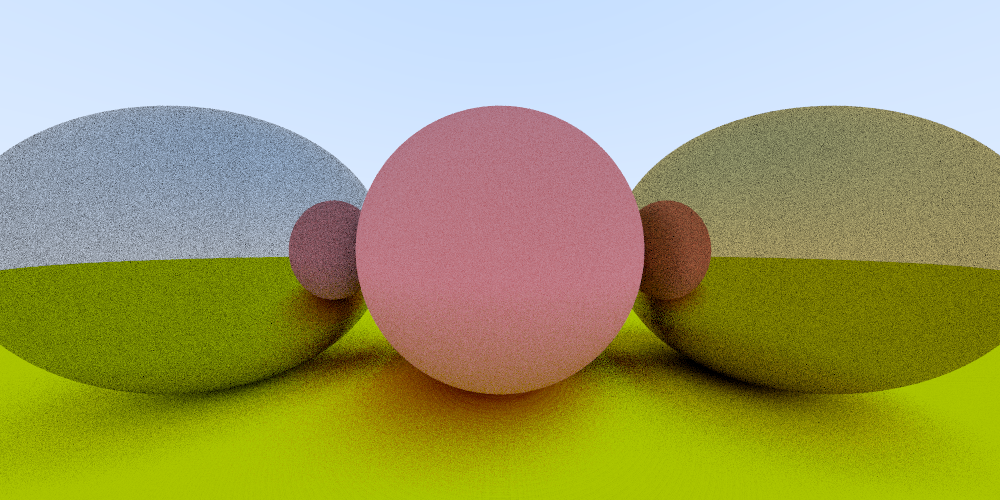

上图的 $spp=16, size=1000\times500$，感觉噪声有点明显，这是还没实现 $fuzz$ 的效果，中间漫反射，左右两个球镜面反射。

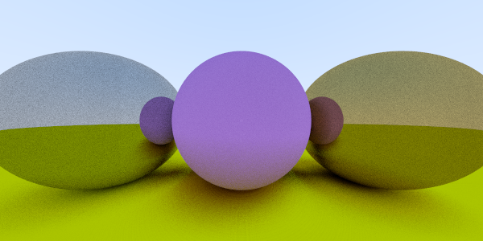

上图的 $spp=100, size=600\times300$，感觉稍微好些了，但是这种采样率感觉效果不太对，给我感觉应该还是随机数的问题。


上图的 $spp=1000, size=600\times300$，随着采样率的提高，整体噪点变少了，但是图像感觉也变模糊了，因为采样越多，后面对颜色的处理其实类似于图像中的均值模糊了。

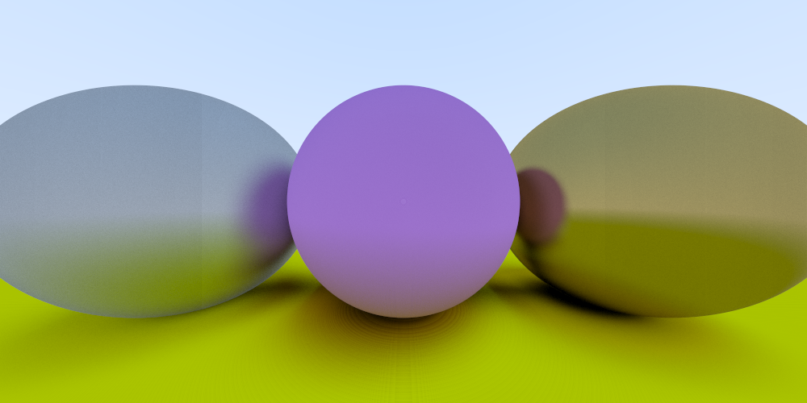

上图的 $spp=1000, size=1000\times500$，这个是加入了 $fuzz$ 的效果，确实有 **铜镜** 那味了，但是看细节可以发现图像两边有那种噪点过渡的边界，感觉很奇怪，原因大抵是随机数或者数值精度的毛病。

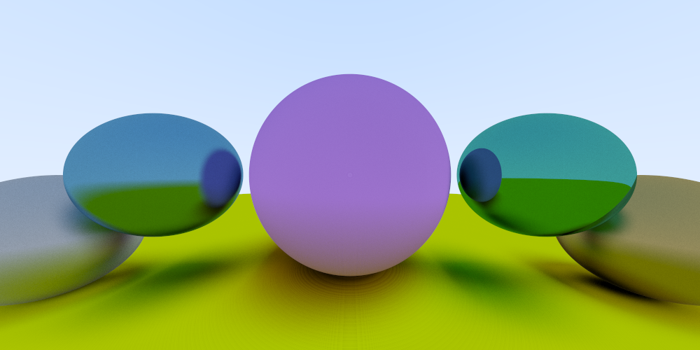

上图的 $spp=1000, size=1000\times500$，展示了不同 $fuzz$ 值的效果。


### Chapter-09

解决前面留下的一个问题，**精度问题**，在判断是否击中的时候，由于计算机中的浮点值具有浮点误差，导致有些可以击中的点被判断为没击中，因此改动了一下代码：

```cpp
// 判断有根与否并求根，取小的根作为击中点所需要的时间(可以把t抽象成时间)
// ShadowEpsilon = 0.0001
if (discriminant > 0) {
	Float invA = 1.0 / (2.0 * a);
	Float temp = (-b - sqrt(discriminant)) * invA;
	if (temp < ShadowEpsilon) {
		temp = (-b + sqrt(discriminant)) * invA;
	}
	if (temp < ray.tMax && temp > ShadowEpsilon) {
		rec.t = temp;
		rec.p = ray(temp);
		rec.normal = Normal3f((rec.p - center) * invRadius);
		rec.mat = material;
		return true;
	}
}
```

成像差别：

(1) 未修改

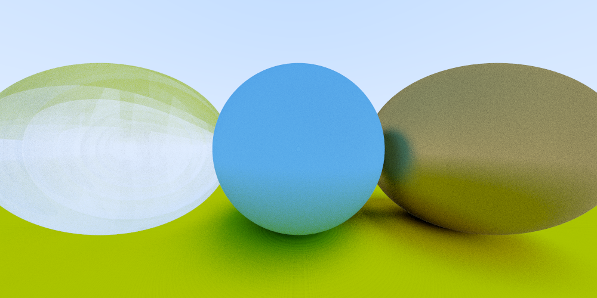

(2) 第一次修改后

-1000x500.png)

巨难受。。。左边这个球的黑边就是作者出现的那种效果，我真的是服了，花了半个下午的时间才发现作者在实现折射函数时里面有个问题。一切尽在注释中，我还回头看了一下作者实现Vec3的代码，他归一化时返回的是一个新向量，并没有改变原来的向量，因此这里确实会造成错误。

```cpp
inline bool Refract(const Vector3f& v, const Vector3f& n, Float niOverNo, Vector3f& refracted){
	Vector3f uv = Normalize(v);
	Float dt = Dot(uv, n);
	// 这里主要是判断能不能折射出来
	Float discriminant = 1.0 - niOverNo * niOverNo * (1 - dt * dt);
	if (discriminant > 0) {
		// 这里应该是（uv - n * dt）
		// 错误：（这里的 v 没有归一化）refracted = niOverNo * (v - n * dt) - n * sqrt(discriminant);
		refracted = niOverNo * (uv - n * dt) - n * sqrt(discriminant);
		return true;
	}
	return false;
}
```

(3) 第二次修改后

-1000x500.png)

痛，太痛了，伊苏尔德😭！！！

**实现另一个性质**，比方说我们看窗子，视角越垂直表面，就越透明，越靠经边边角角就有镜子的效果，眼镜也是这样。

**实现Schlick的近似公式**
(1) 一个玻璃球

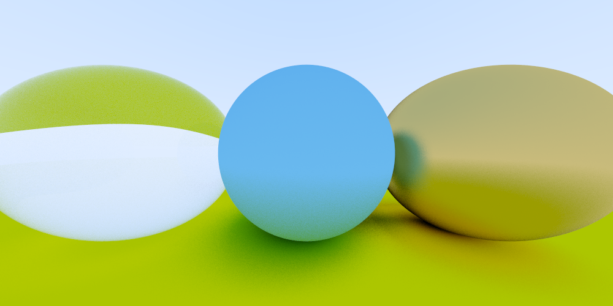

(2) 一个玻璃球里面再放一个玻璃球，但是里面那个设置的半径是负数，这会使得其生成的法线朝球体内部，这个效果就相当于是一个中空的玻璃球。

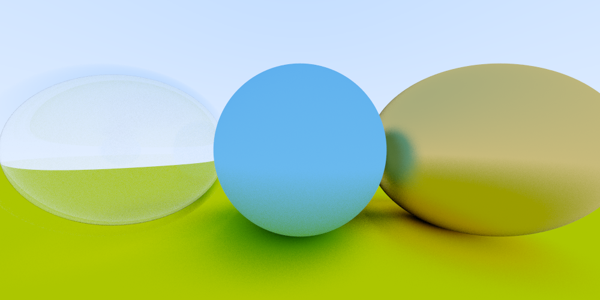

(3) 尝试一下在中空的玻璃球里再放一个球

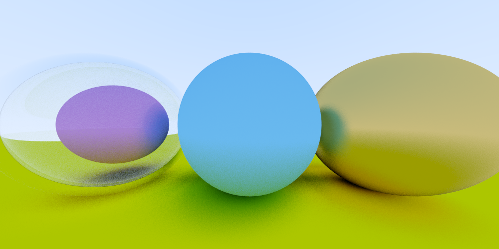

<center> 磨砂材质球 </center>

   
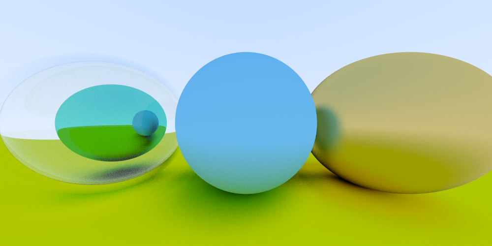

<center> 金属材质球 </center>

**折射原理以及公式推导：**

首先看图，我仿照原书画的：

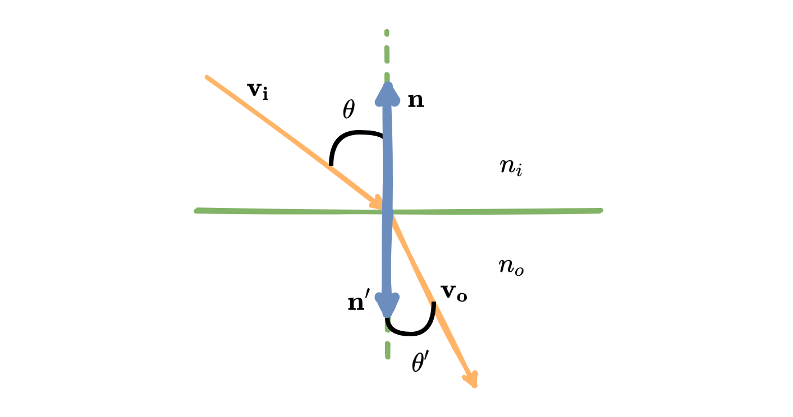

$\mathbf{n,n'}$ 是不同方向的法线向量且都做了归一化处理；
$\mathbf{v_i,v_o}$ 分别是入射向量和折射向量，且都是单位向量；
$\mathbf{\theta,\theta'}$ 分别是两面的夹角；
$\mathbf{n_i,n_o}$ 是不同面的折射率；

了解了基本概念后，我们需要求解的是 $\mathbf{v_o}$

首先是 **Snell** 公式:

$$
\begin{aligned}
n_i\sin\theta=n_o\sin\theta' 
\end{aligned}
$$

先判断是否能够折射出去，因为你想，如果从折射率大的一面折射出去，当夹角 $\theta$ 很大的时候，比如 $\theta=90, n_i=1.5,n_o=1.0$，那么要想满足上式则 $ sin\theta' > 1 $ 才行，这显然是不可能的，故这里当出现这种情况的时候将不产生折射，而是反射全部光线，这种现象叫做**全反射**。 

如何判断呢？
$$
\begin{aligned}
\sin^2\theta' &= \left(\frac{n_i}{n_o}\right)^2\sin^2\theta \\
&=\left(\frac{n_i}{n_o}\right)^2(1-\cos^2\theta) < 1.0
\end{aligned}
$$

对应代码就是：
```cpp
Float dt = Dot(uv, n); // cosθ < 0
// 这里主要是判断能不能折射出来
Float discriminant = 1.0 - niOverNo * niOverNo * (1 - dt * dt);
if (discriminant > 0) {
	// To do...
}
```

接下来判断完就可以去求解 $\mathbf{v_o}$
如下图：

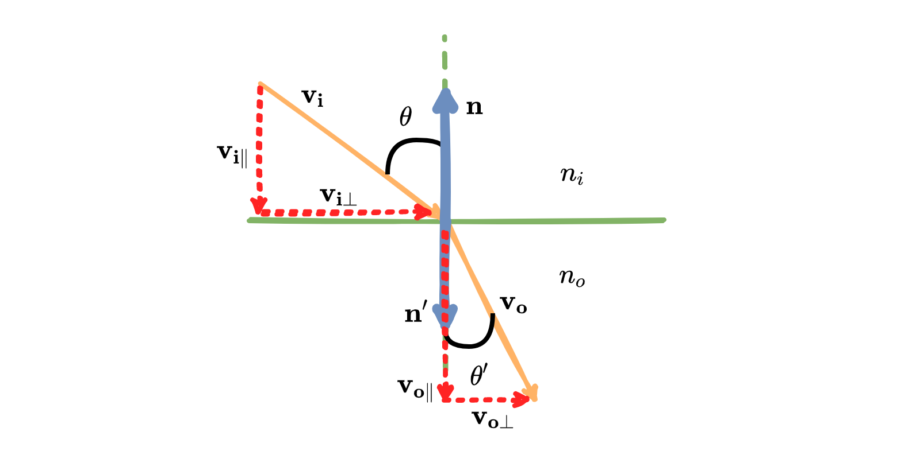

我们可以将 $\mathbf{v_i,v_o}$ 分解
$$
\mathbf{v_i} = \mathbf{v_{i\|}} + \mathbf{v_{i\perp}} \\
\mathbf{v_o} = \mathbf{v_{o\|}} + \mathbf{v_{o\perp}} \\
$$
其中
$$
\begin{aligned}
\mathbf{v_{i\|}} &= (\mathbf{v_i}\cdot (\mathbf{-n}))(\mathbf{-n})\\
&= (|\mathbf{v_i}||\mathbf{\mathbf{-n}}|\cos\theta)(\mathbf{-n}) \\
&= -\cos\theta(\mathbf{n})
\end{aligned}
$$
同理
$$
\begin{aligned}
\mathbf{v_{o\|}} = \cos\theta'(\mathbf{n'})
\end{aligned}
$$
解析 $\mathbf{v_{i\perp}}$
$$
\begin{aligned}
\sin\theta = \frac{|\mathbf{v_{i\perp}}|}{|\mathbf{v_i}|} = |\mathbf{v_{i\perp}}|, \\
\sin\theta' = \frac{|\mathbf{v_{o\perp}}|}{|\mathbf{v_o}|} = |\mathbf{v_{o\perp}}|,
\end{aligned}
$$

注意，这里 $\mathbf{v_{i\perp}},\mathbf{v_{o\perp}}$ 的方向相同，故

$$
\begin{aligned}
\frac{\mathbf{v_{i\perp}}}{|\mathbf{v_{i\perp}}|} = 
\frac{\mathbf{v_{o\perp}}}{|\mathbf{v_{o\perp}}|}
\end{aligned}
$$

由上式可得：

$$
\begin{aligned}
\mathbf{v_{o\perp}} &= \frac{{|\mathbf{v_{o\perp}}|}}{|\mathbf{v_{i\perp}}|}\mathbf{v_{i\perp}} 
= \frac{\sin\theta'}{\sin\theta}\mathbf{v_{i\perp}} = \frac{n_i}{n_o} \mathbf{v_{i\perp}} = 
\frac{n_i}{n_o} (\mathbf{v_{i}}+ |\mathbf{v_{i}}|\cos\theta(\mathbf{n})) \\
\mathbf{v_{o\|}} &= \cos\theta'(\mathbf{n'}) = -\cos\theta'(\mathbf{n}) = - \sqrt{1-\sin^2\theta'}(\mathbf{n}) = -\sqrt{1-|\mathbf{v_{o\perp}}|^2}(\mathbf{n})
\end{aligned}
$$

最终：
$$
\begin{aligned}
\mathbf{v_o} &= \mathbf{v_{o\|}} + \mathbf{v_{o\perp}} \\
&= \frac{n_i}{n_o} (\mathbf{v_{i}}+ \cos\theta(\mathbf{n})) - \sqrt{1-|\mathbf{v_{o\perp}}|^2}(\mathbf{n})
\end{aligned}
$$

对应代码:
```cpp
// cos(theta) < 0，因为没有点乘 -n，但是并不影响
// 只有下式中 (uv - n * dt) 本来推导式应该是 (uv + n * dt) 
refracted = niOverNo * (uv - n * dt) - n * sqrt(discriminant);
```

其次真实的玻璃反射率会随着视角变化，其实就是**菲涅尔反射**效应，因此还需要用一个公式来获得真实的效果，但原始方程太复杂了（菲涅尔公式），这里采用的是 Christophe Schlick 使用多项式近似简化过的方程：
$$
F(F_0,\theta_i) = F_0+(1-F_0)(1-\cos\theta_i)^5, \\
F_0=\left(\frac{n_i - n_o}{n_i + n_o}\right)^2
=\left(\frac{\frac{n_i}{n_o} - 1}{\frac{n_i}{n_o} + 1}\right)^2
$$

代码：
```cpp
inline Float Schlick(Float cosine, Float refIdx) {
	Float r0 = (1 - refIdx) / (1 + refIdx);
	r0 *= r0;
	return r0 + (1 - r0) * pow((1 - cosine), 5);
}
```

到此整个推导就结束了，不仅要得到效果，还要了解背后的原理，前路漫漫啊，还好头发多🤡

### Chapter-10

本章进一步设计了摄像机的一些参数，能够有更多的操作性。

首先实现的是 **FOV(Field of view)** , 也叫做**视场**，如下图。

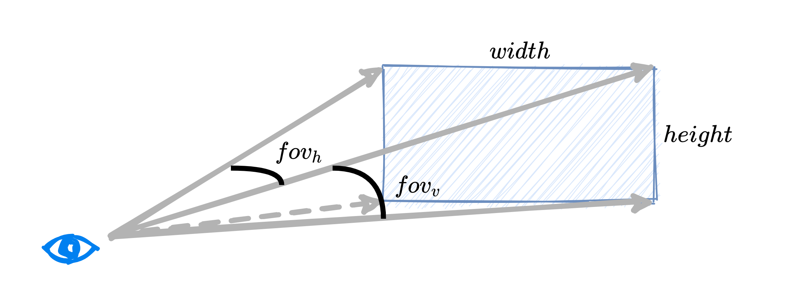

$fov_h$ 指的是视角水平方向的最大夹角，
$fov_v$ 指的是视角垂直方向的最大夹角，本节已实现

$aspect = \frac{width}{height}$ 指的是视角的比例，有了这个，我们便可以根据一个方向的值算出另一个方向的值。

比如计算长宽的一半 $halfWidth,halfHeight$.

$$
halfHeight = \tan(fov_h\pi/180), \\
halfWidth = halfHeight * aspect \\
$$

接下来再来看看如何推导可以改变视角位置和成像平面的摄像机，其作为坐标轴的基向量怎么求？

如图：


$\mathbf{y},\mathbf{u},\mathbf{w}$ 是组成三个轴的基向量，
$\mathbf{up}$ 是切平面上朝上的向量，
$lf,lr$ 分别是观测的位置和观测的目标位置。


已知 $\mathbf{up}, lf,la$ ，求 $\mathbf{y},\mathbf{u},\mathbf{w}$

原理利用叉乘即可, 注意这里用的是**右手坐标系**

$$
\mathbf{w} = Normalize(lf-la); \\
\mathbf{u} = Normalize(Cross(\mathbf{up},\mathbf{w})); \\
\mathbf{v} = Normalize(Cross(\mathbf{w},\mathbf{u}));
$$

有了这些值，我们再将代码中的变量 $lowerLeftCorner, horizontal, vertical,origin$ 求得即可。

$$
lowerLeftCorner = lf-(\mathbf{-v_1} + \mathbf{v_2} + \mathbf{v_3}); \\
\mathbf{-v_1} = \mathbf{w},\mathbf{v_2} = halfHeight*\mathbf{y},\mathbf{v_3} = halfWidth * \mathbf{u}, \\
horizontal = 2 * halfWidth * \mathbf{u} ; \\
vertical = 2 * halfHeight * \mathbf{v}; \\
origin = lf
$$

```cpp
lowerLeftCorner = Vector3f(origin) - halfWidth * u - halfHeight * v - w;
horizontal = 2 * halfWidth * u;
vertical = 2 * halfHeight * v;
```

这样就完成了摄像机的一些概念设计，看一下效果图。

(1) $fov = 90$

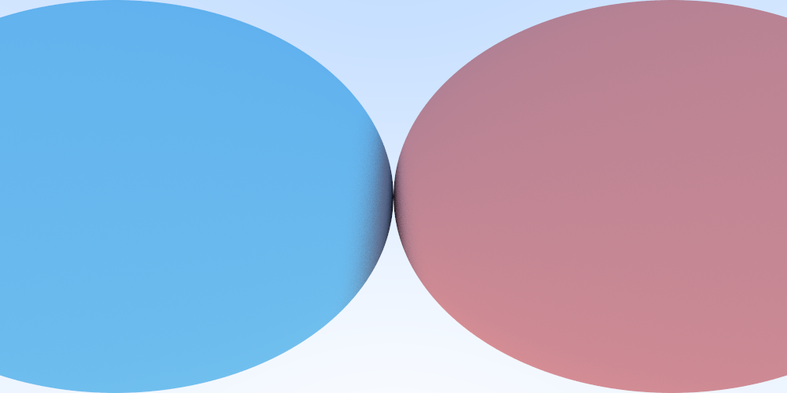

(2) $fov = 60$

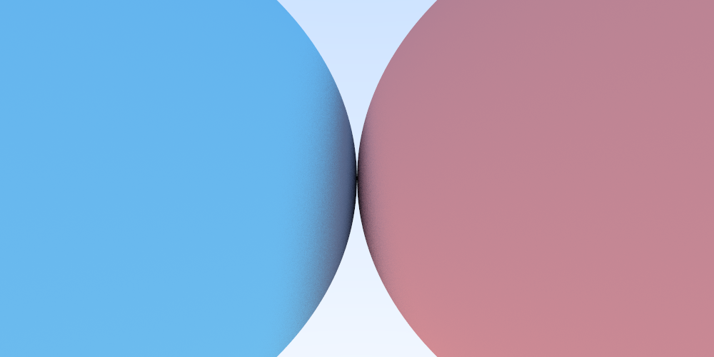

(3) $fov = 120$

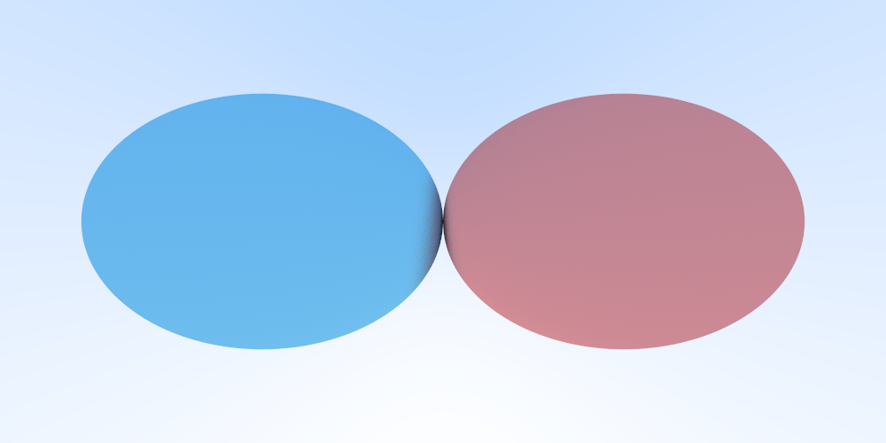

(4) $fov = 90, lf=(-2, 2, 1), la=(0, 0, -1),\mathbf{up}=(0, 1, 0)$

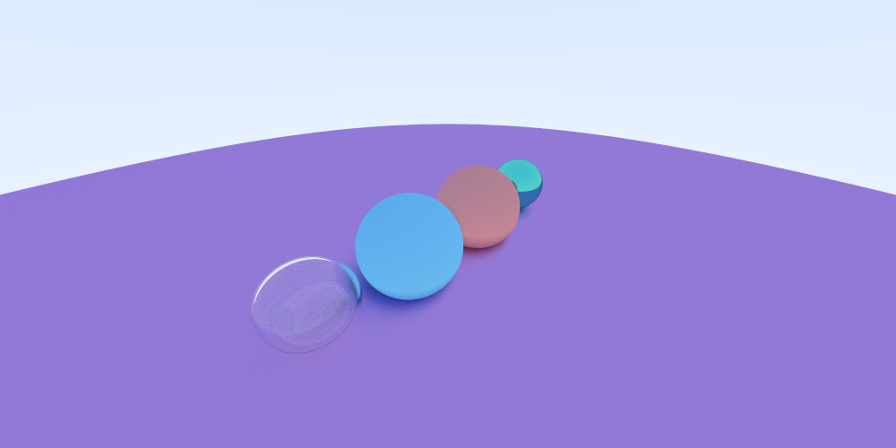

(5) $fov = 30, lf=(-2, 2, 1), la=(0, 0, -1),\mathbf{up}=(0, 1, 0)$


(6) $fov = \{x | x\in[0, 180]\}$


### Chapter-11

本节主要实现的是摄像机的**景深**效果，这里作者也称作离焦模糊。

这里具体相机的原理我就不再详解，有兴趣可以自己去查阅，主要对代码实现的原理进行一定的说明。

主要引入了几个概念：
$focusDis$ ：焦平面到视点的距离（焦距）
$aperture$ ：光圈大小

代码实现的原理其实就是通过这些参数改变生成的光线，物理上的原理实际上就是视角通过光圈的视线会像凸透镜一样汇聚于一点，那个点就是焦点。

主要通过随机采样来获得在光圈中的视线偏移 $\mathbf{offset}$ ，然后通过偏移值获得偏移后的光线。

我们来看看如何理解光线的生成，光线是由**起点** $\mathbf{ray_o}$ 和 **方向** $\mathbf{ray_d}$ 构成。

由于焦距的设置，我们的成像平面会改变位置，因此之前的一些参数也会受焦距影响，分别是：

$$
lowerLeftCorner = origin - halfWidth * \mathbf{u} * focusDis - halfHeight * \mathbf{v} * focusDis - \mathbf{w} * focusDis; \\
horizontal = 2 * halfWidth * \mathbf{u} * focusDis; \\
vertical = 2 * halfHeight * \mathbf{v} * focusDis;
$$

光线从原始变化为通过透镜的结果 $\mathbf{ray} \to \mathbf{ray'}$

如图结合向量的加减法可以明确的理解光线是怎么变化的。

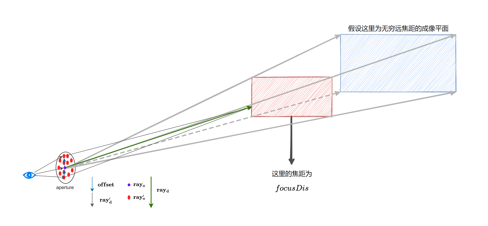

$$
\begin{aligned}
\mathbf{ray'_o} = \mathbf{ray_o} + \mathbf{offset} 
				= origin + \mathbf{offset},
\end{aligned}
$$

$$
\begin{aligned}
\mathbf{ray'_d} = \mathbf{ray_d} - \mathbf{offset} =lowerLeftCorner + s * horizontal + t * vertical - origin - \mathbf{offset},\\
\end{aligned}
$$

接下来就是见证效果的时候了，光是静态的没意思，看不出这些参数对成像的影响，因此我还通过设置不同的参数变换来形成动态图像，把 [Chapter-10](#chapter-10) 的也补上**fov**的变化。

(1) 参数设置
$lookFrom = (3, 3, 2), $
$lookAt = (0, 0, -1), $
$fov = 20, $
$aspect = 2.0, $
$aperture = 2.0, $
$focusDis = |lookFrom - lookAt|;$

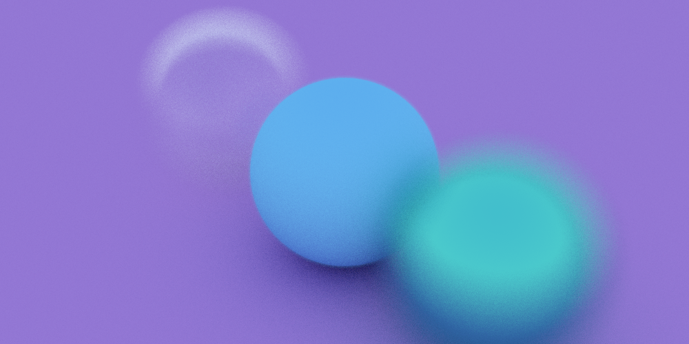

(2) 
$lookFrom = (3, 3, 2), $
$lookAt = (0, 0, -1), $
$fov = 20, $
$aspect = 2.0, $
$aperture = \{x | x\in[0, 4]\}, $
$focusDis = |lookFrom - lookAt|;$


(3) 
$lookFrom = (3, 3, 2), $
$lookAt = (0, 0, -1), $
$fov = 20, $
$aspect = 2.0, $
$aperture = 1.0, $
$focusDis = \{x | x\in[0, 2 * |lookFrom - lookAt|]\};$


### Chapter-12

这章就没啥内容了，主要是实现一些随机的球，还原这本书的封面图，顺便说说代码的进一步的提升，后面会涉及到的一些更高级的概念。

生成的图像依然感觉有点问题：
(1) $spp=100, fov=40$

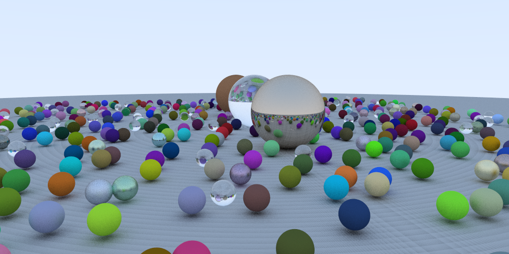

(2) $spp=16, fov=20$

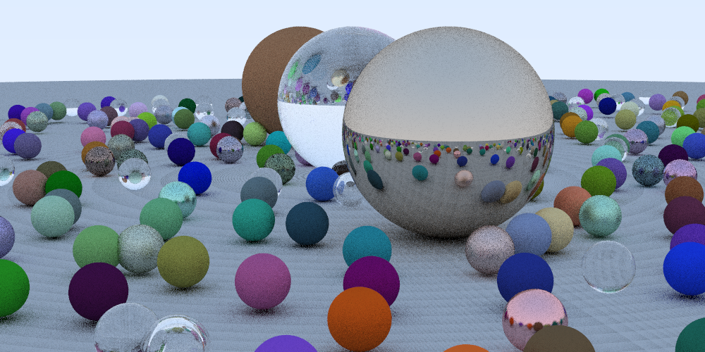

(3) $spp=100, fov=20$

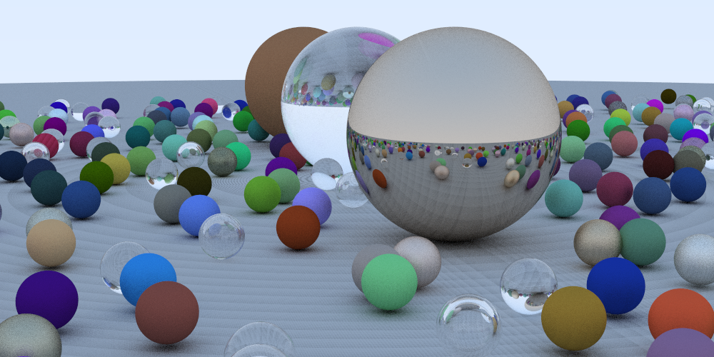

**原因还是浮点误差的影响，将击中点的判断偏移一下，效果就会好很多，主要修改代码中的 “ShadowEpslion”**

(4) $spp=100, fov=20$

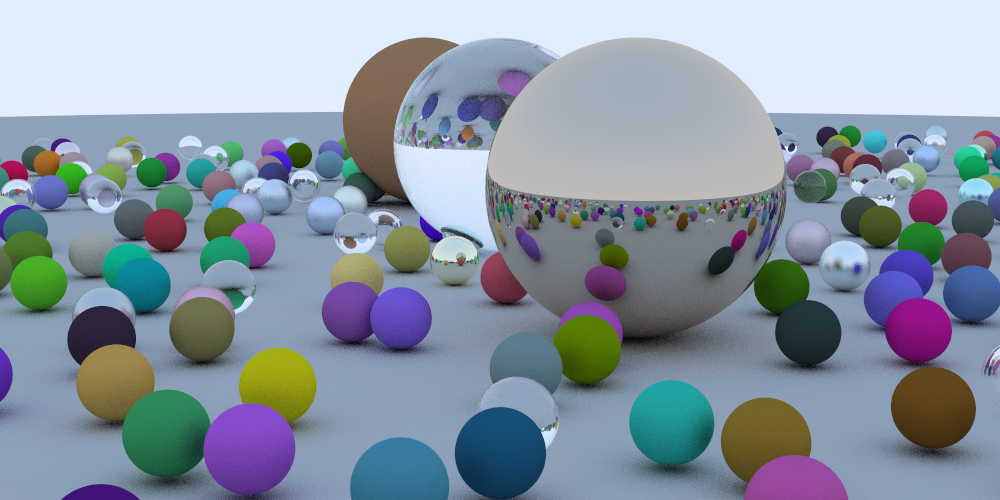

(5) $spp=1000, fov=20$

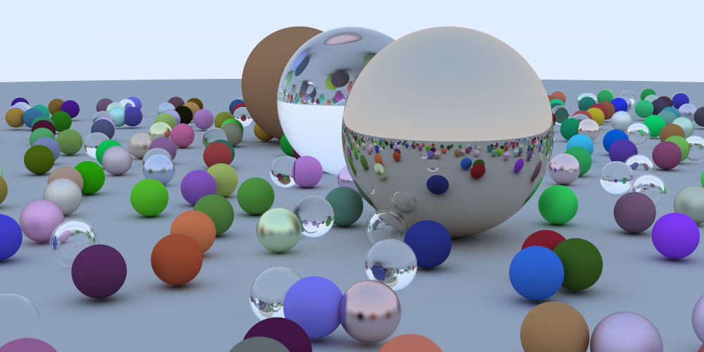

## Custom addition

敲完 [Ray Tracing In One Weekend](#implementation-of-ray-tracing-in-one-weekend) 后，个人认为可以沉淀一下，把感兴趣的东西加上去，于是就有了这一节的内容。

### 1. Add Shape

#### Cylinder

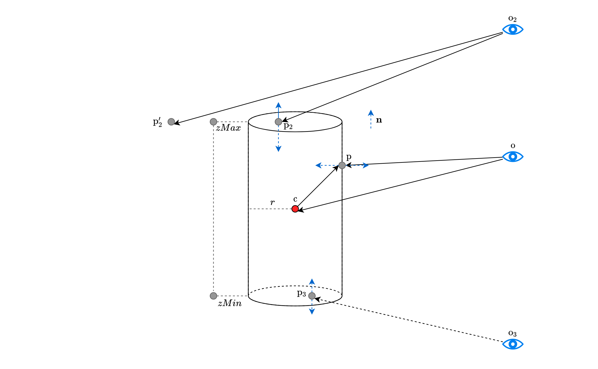

构造一个圆柱体，我们需要解决什么？**如何击中圆柱？如何获得法线？** 有了击中点的信息，我们就可以将后面的认为交给光线的传播了。

让我们一步一步来解决这些问题。

**获得击中的位置**

求点 $\mathrm{p}$
已知 $\mathrm{c, o}, r, zMax, zMin$

**(1)** 先分析常见的情况，就是**击中侧面**，可以利用向量来获得结果。
我们从二维的情况去分析，比如俯视图。

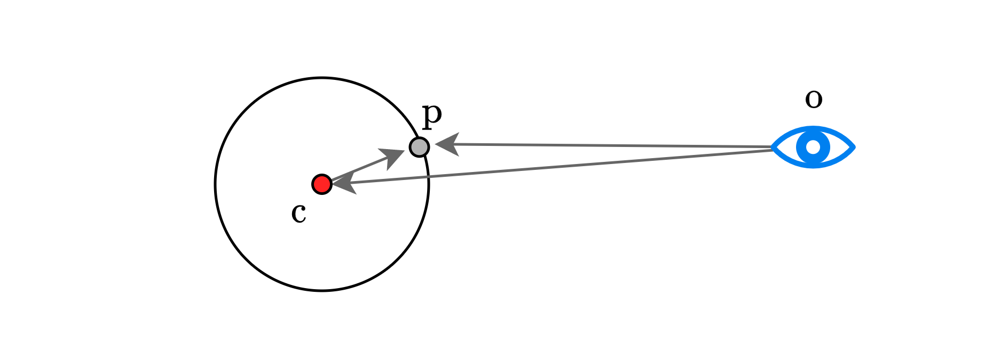

$$
\mathrm{p} = ray_\mathrm{o} + ray_\mathbf{d}\times t;
$$

$$
\mathbf{cp}\cdot\mathbf{cp}=\|\mathbf{cp}\|=r^2;
$$

$$
\mathbf{cp} = \mathbf{op} - \mathbf{oc};
$$

$$
\mathbf{op} = \mathrm{p} - \mathrm{o} = ray_\mathbf{d} \times t = (t\mathbf{d}_x, t\mathbf{d}_y)
$$

$$\mathbf{oc} = \mathrm{c} - \mathrm{o} = (\mathrm{c}_x-\mathrm{o}_x,\mathrm{c}_y-\mathrm{o}_y)$$

$$
\mathbf{cp} = (t\mathbf{d}_x +(\mathrm{o}_x-\mathrm{c}_x),t\mathbf{d}_y +(\mathrm{o}_y-\mathrm{c}_y) )
$$

$$
\mathbf{cp} \cdot \mathbf{cp}=(\mathbf{d}_x^2+\mathbf{d}_y^2)t^2 + 2(\mathbf{co}_x\mathbf{d}_x + \mathbf{co}_y\mathbf{d}_y)t + \mathbf{co}_x^2 + \mathbf{co}_y^2 = r^2
$$

最终获得一元二次方程：
$$
(\mathbf{d}_x^2+\mathbf{d}_y^2)t^2 + 2(\mathbf{co}_x\mathbf{d}_x + \mathbf{co}_y\mathbf{d}_y)t + \mathbf{co}_x^2 + \mathbf{co}_y^2 - r^2=0
$$

其中未知数就只有 $t$ ，利用求根公式求出即可。

求根很好理解，但是出现的情况却很多。通过求出 $t$ 后，我们代入回三维来获得击中点的位置 $\mathrm{p}$

注意一元二次方程可能有 $0,1,2$ 个解，无解表示圆柱体在视角后面，一个解表示视角在圆柱体内部，两个解表示在视角前面。

如果 $ zMin < \mathrm{p} < zMax $ ，说明击中了，再继续求其法线 $\mathbf{n}$ 。

$$
\mathbf{n} = Normalize((\mathrm{p}_x - \mathrm{c}_x , 0 , \mathrm{p}_z - \mathrm{c}_z ))
$$

否则光线可能是击中顶端或者底端，这就引入了情况 (2)

**(2)** **击中顶端或者底端**

**(2.1) 视角在圆柱体外部**

如果视角位置高于圆柱顶端且光线方向在 $y$ 分量上的值小于0才可能击中顶端

$$
t = (zMax - \mathrm{o}) / \mathbf{d}_y;
$$

计算出 $t$ 后获得 $\mathrm{p}$，若击中顶部需满足以下条件：

$$
\mathbf{cp}_x^2+\mathbf{cp}_y^2\leq r
$$

如果视角位置低于圆柱底端且光线方向在 $y$ 分量上的值大于0才可能击中底端

$$
t = (zMin - \mathrm{o}) / \mathbf{d}_y;
$$

击中条件同上。

**(2.2) 视角在圆柱体内部**

$zMin \leq \mathrm{o}_z\leq zMax$

如果光线方向在 $y$ 分量上的值大于0才可能击中顶端

$$
t = (zMax - \mathrm{o}) / \mathbf{d}_y;
$$

击中条件同上。

如果光线方向在 $y$ 分量上的值小于0才可能击中底端

$$
t = (zMin - \mathrm{o}) / \mathbf{d}_y;
$$

击中条件同上。

满足条件后求其法线 $\mathbf{n}$ 。

$$\mathbf{n} = Normalize((0, 0, \mathrm{p}_z - \mathrm{o}_z))$$

---

至此理论阐述完毕，在代码中主要就是理清逻辑关系，由于情况较多，条件控制语句也会出现很多，我一开始就是很多条件没弄清楚，造成很多 **bug** , 接下来就是见证效果的时候了。


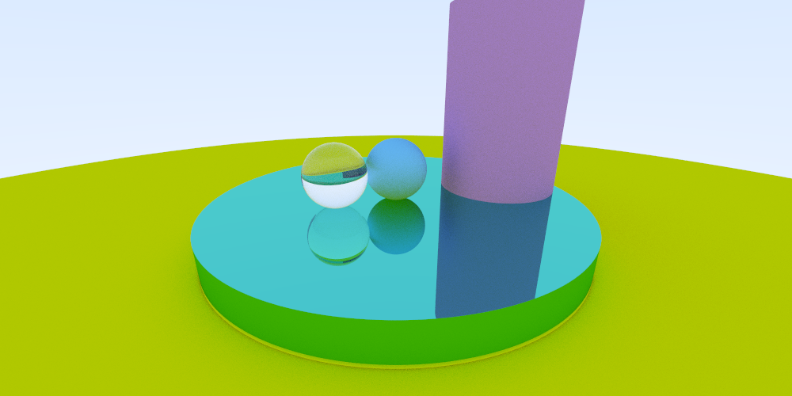

下面这张图渲染了两三个小时。。

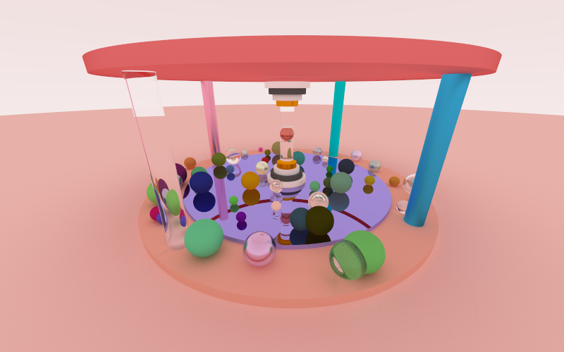

### GPU Mode

由于离线渲染使用cpu实在是太慢了，因此下定决心将之前的代码修改一个GPU版本的。

主要使用的是 **CUDA** ，当然还有 **Optix，Direct3d, Opengl** 等api可以来用，不过这些后面再说吧。

参考文章：[Accelerated Ray Tracing in One Weekend in CUDA](https://developer.nvidia.com/blog/accelerated-ray-tracing-cuda/)

在改进的过程中遇到了很多问题，还有改进完成后上传github遇到的让人及其不适的问题。

**改进过程中：**
(1) 需要安装CUDA环境，也就是**cudatoolkit**，这个可以自行查阅安装过程。
(2) 使用CUDA的时候需要注意内存分配问题，我就在这上面栽了很多跟头，常常遇到 **CUDA error=700**，这通常都是访问越界，要么是没申明内存，要么是申请的不够。
(3) 最重要的一个点就是申明一个自定义类的时候，把所有的定义都放在 **.h** 文件中，放到 **.cpp** 文件会报错，这里特别需要注意。

**改进完成后上传遇到的问题：**
(1) 首先就是大文件上传，奶奶的，不用LFS上传不了，你用它吧，因为之前已经上传到工作区了，又无法撤销，总而言之就是卡住了，为了上传上去，尝试了网上很多方法，最终落得个本地文件版本回退的结果😭 血的教训，本章就是因为这个问题，又重写的。所以说先备份，重要的事情说三遍，备份！备份！备份！

皇天不负有心人，结果至少来说是可观的，相比于上章节末尾的图片，用GPU模式去生成足足节省了几百倍，GPU只花了两百多秒，而之前的用了九千多秒。

反正现在可以放心的渲染高分辨率，高spp的超清大图了。。

欣赏一波：

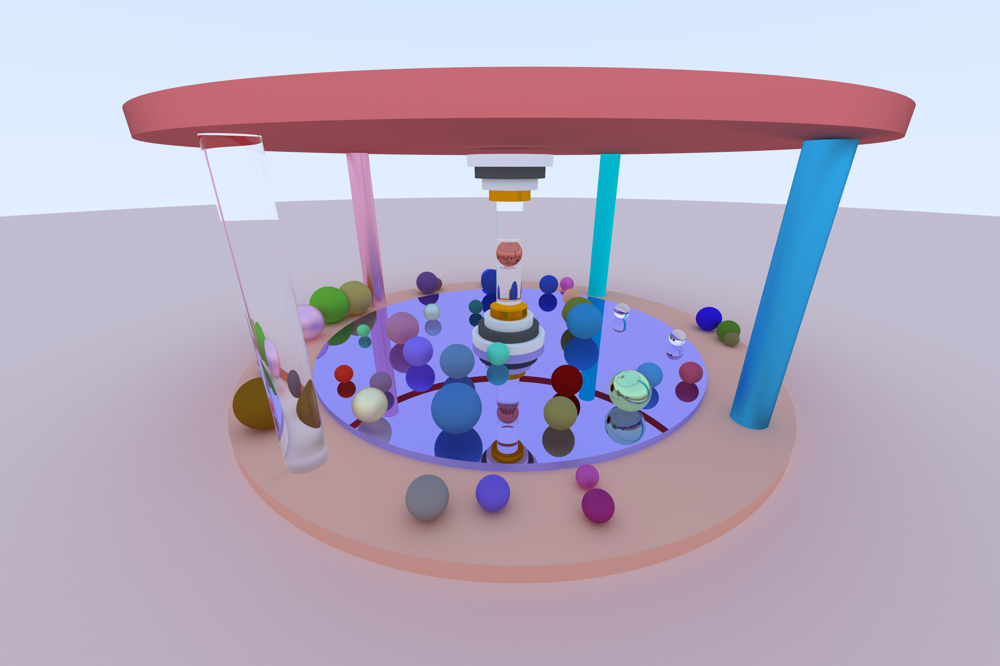

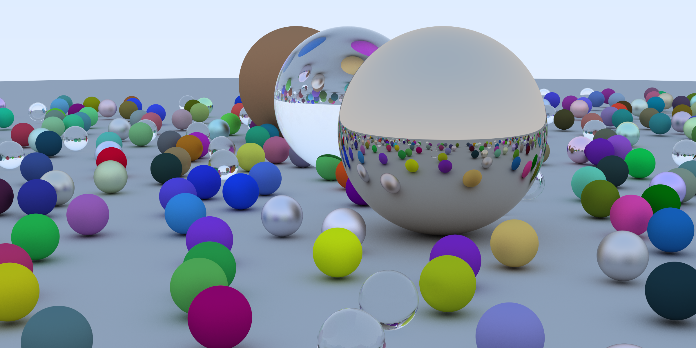

## Implementation of 《Ray Tracing The Next Week》

本章在 [Ray Tracing In One Weekend](#implementation-of-ray-tracing-in-one-weekend) 的基础上添加更多高级的功能，并不断完善以获得一个正儿八经的光线追踪器。

### Chapter-01 : Motion Blur

本节进一步完善了相机的功能：运动模糊。
从现实角度去理解，相机拍摄是通过快门的开合来捕获光量已形成图像，而当我们的快门时间则是影响图像光量的大小，快门时间越久，进光量就越大，图像就会越亮，反之越少。在虚拟世界中，我们不需要通过改变这些参数来提升捕获的光量。但是改变快门时间会造成一种效果，称为 **运动模糊** ，这个效果常常属于那种快门速度跟不上物体运动的速度，然后造成残影一样的效果，cool！

代码上的设计很简单，简单梳理一下，主要在相机中加入两个时间刻度，然后在这之间随机生成一个时间值传入光线类中，最后在击中物体的时候，将这个时间变量用来改变物体的重心位置，以此来模拟物体在运动的效果。

效果图：

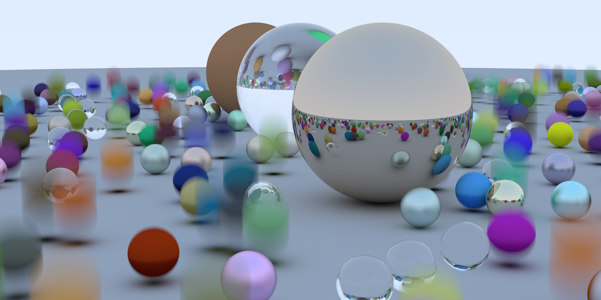


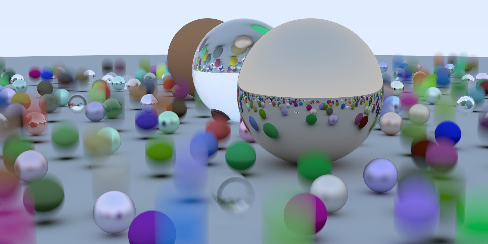