# GraphicsEngine
The implementation of "RayTracing, RealTime Rendering, Rasterization Rendering" 

## Implementation of 《Ray Tracing In One Weekend》
### Chapter-01

---
使用了一个图像处理库，"stb_image_write.h",
大概操作如下：
```cpp
// 申请一块连续的内存用来存储像素
auto* data = (unsigned char*)malloc(width * height * channel);

// To do...

// 写入图像
stbi_write_png("output-chapter01.png", width, height, channel, data, 0);

// 释放内存
stbi_image_free(data);
```
### Chapter-02
这一章节主要是构建一些基元用以构建整个图形学的世界，主要就是向量类，这里我没有根据 **Ray Tracing In One Weekend** 的思想来，而是直接迁移了 **PBRT** 一书中有关 **Vector, Point, Normal** 的实现，具体可参见 [pbrt.org](https://www.pbrt.org/)

相比于上一章，主要是用 Vector 来承载RGB颜色并输出。

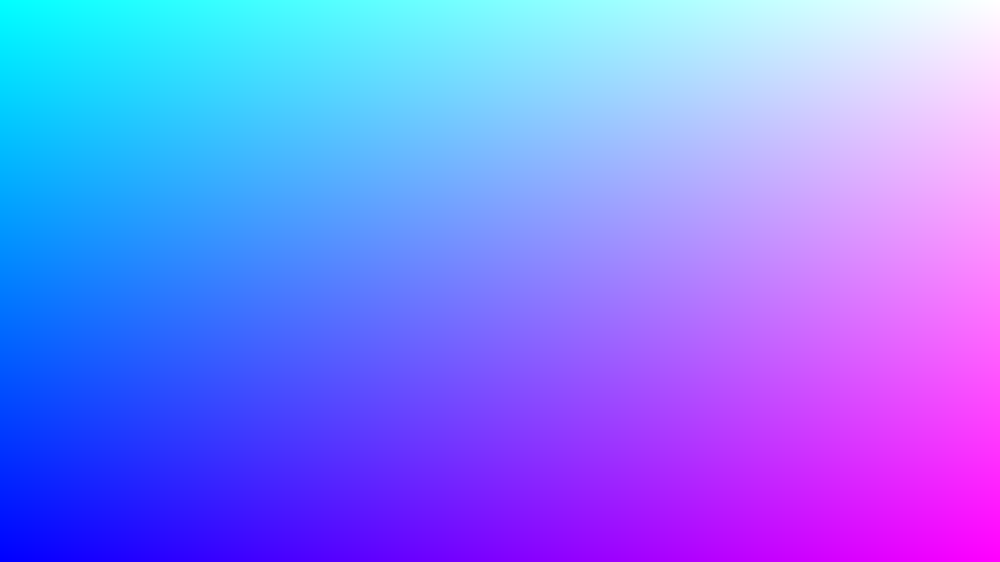
### Chapter-03
设计一个简单的光线类(Ray)，同时用简单的方式来测试光线的值，转化为一种简便的颜色，可以用来当作背景。这里因为看过pbrt，再加上后面也会以此为基础添加更多的功能，因此直接将pbrt中的光线类代码搬了过来使用。毕竟有更好的轮胎🤣

使用不同分量来插值以得到不同的视觉感受
```cpp
// Chapter03 : simple color function
Point3f Color(const Ray& ray) {
	Vector3f dir = Normalize(ray.d);
	Float t = 0.5 * (dir.y + 1.0);
	return Lerp(t, Point3f(1.0, 1.0, 1.0), Point3f(0.5, 0.7, 1.0));
}
```

我分别测试了三种分量来获得不同的效果。

---
$$t=0.5\times(\mathbf{dir}_y + 1.0)$$

 

---
$$t=0.25\times(\mathbf{dir}_x + 2.0)$$

 

---
 $$t=\mathbf{dir}_z + 2.0$$

 

至于 $t$ 为什么要这么计算，目的主要是为了将其区间映射至 $[0,1]$ .

### Chapter-04
利用球体的公式来绘制球，通常来说，图形学里绘制几何有两种方式，分别是隐式和显式，凡是有公式的都属于前者，后者则是直接提供构成曲面的顶点。

这里我的代码和书中稍微有点不一样，主要为了实现距离对其颜色的影响，让其在远近上颜色有一定的过渡。

```cpp
static Point3f sphereCenter(0, 0, -1); // 设置圆的中心
static Float sphereRadius = 0.5; // 设置圆的半径

// Chapter04 : simple sphere
bool HitSphere(const Point3f& center, Float radius, const Ray& ray, Float& t) {
	Vector3f oc = ray.o - center;
	Float a = Dot(ray.d, ray.d);
	Float b = 2.0 * Dot(oc, ray.d);
	Float c = Dot(oc, oc) - radius * radius;
	Float discriminant = b * b - 4 * a * c;
	// 判断有根与否并求根，取小的根作为击中点所需要的时间(可以把t抽象成时间)
	if (discriminant > 0) {
		Float invA = 1.0 / (2.0 * a);
		Float t0 = (-b + sqrt(discriminant)) * invA;
		Float t1 = (-b - sqrt(discriminant)) * invA;
		t = min(t0, t1);
		return true;
	}
	return false;
}

// Chapter03-04 : simple color function
Point3f Color(const Ray& ray) {
	Float t;
	if (HitSphere(sphereCenter, sphereRadius, ray, t)) {
		t = exp(-t); // 将 t 映射至 (0, 1] 以此获得远近颜色过渡的效果
		return Lerp(t, Point3f(0.2, 0.2, 0.2), Point3f(0.6, 0.4, 0.5));
	}
	// 没击中就画个背景
	Vector3f dir = Normalize(ray.d);
	t = 0.5 * (dir.y + 1.0);
	return Lerp(t, Point3f(1.0, 1.0, 1.0), Point3f(0.5, 0.7, 1.0));
}
```

效果图：

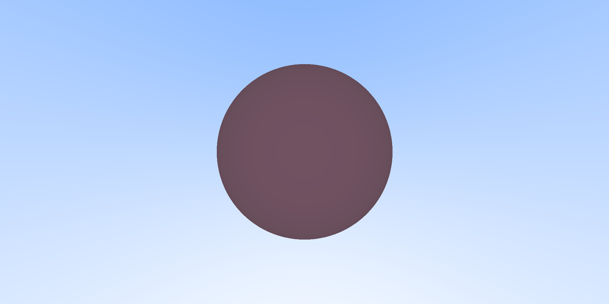

### Chapter-05
本章主要引入了法线的概念，并且简单实现了球体的法线。在图形学中法线是必不可少的一个概念，后面不管是任何的渲染公式都会用到，包括后面的 **半程向量(halfDir)，视角向量(viewDir)** 都是重要的概念。

本节主要将球体的法线可视化出来，这里是相当于直接使用世界坐标轴下的法线向量输出成rgb，相对来说还没有涉及到在**切线空间**下的表示，后面会慢慢加入这些功能。另外将这些几何体抽象成一个单独的类，目前还只有球的表示，后面应该会结合 **pbrt** 中的几何章节加入不同的几何体表示。

**法线可视化**：

```cpp
// Chapter03-04 : simple color function
Point3f Color(const Ray& ray) {
	Float t;
	if (HitSphere(sphereCenter, sphereRadius, ray, t)) {
		// Chapter-05:击中就求其击中点的法线，球的法线直接就是击中点连接球中心的交点
		Vector3f N = Normalize(ray(t) - sphereCenter); 
		Vector3f normalColor = (N + Vector3f(1.0, 1.0, 1.0)) * 0.5;
		return Point3f(normalColor.x, normalColor.y, normalColor.z);
	}
	// 没击中就画个背景
	Vector3f dir = Normalize(ray.d);
	t = 0.5 * (dir.y + 1.0);
	return Lerp(t, Point3f(1.0, 1.0, 1.0), Point3f(0.5, 0.7, 1.0));
}
```


这里解释一下为什么会出现这样的效果，设置法线表示 $\mathbf{N}$ .
首先从世界坐标的角度去理解，朝屏幕上方的 $\mathbf{N} \to [0.0,1.0,0.0]$，故其颜色分量 $rgb \to [0.0,1.0,0.0]$，因此造成朝上的方向会更绿，原因就是其 $green$ 分量的值更大；同理屏幕左边和右边也可以这样去理解。

**抽象类**：
通过 **Shape** 作为基类，派生出 **Sphere, ShapeList** 类，其中我自己实现的方式和书中有一些不同，比如命名方式，以及使用了智能指针和vector容器来实现 **ShapeList** 。

最终实现本节的两个球体效果。

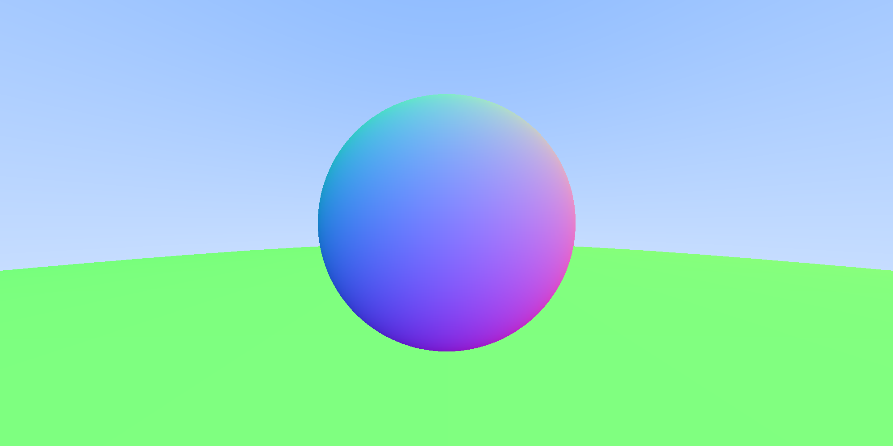

**纠正代码：**
 ```cpp
 for (int sy = height - 1; sy >= 0; sy--)
{
	for (int sx = 0; sx < width; sx++)
	{
		Float u = Float(sx) / Float(width);
		Float v = Float(height - sy - 1) / Float(height);
		
		Ray ray(origin, lowerLeftCorner + u * horizontal + v * vertical);
		
		Point3f color = Color(ray, world);
		
		int ir = int(255.99 * color[0]);
		int ig = int(255.99 * color[1]);
		int ib = int(255.99 * color[2]);
		
		int shadingPoint = (sy * width + sx) * 3;
		data[shadingPoint] = ir;
		data[shadingPoint + 1] = ig;
		data[shadingPoint + 2] = ib;
	}
}
 ```
 前面使用按照书中的方式，但是计算 **v** 感觉有点违背直觉，因此我将计算的结果与视角相联系了起来，修改了 **v, shadingPoint** 的计算过程。

 ### Chapter-06
 本章主要是将摄像机抽象成了一个类，毕竟现代编程，OOP(面向对象)是一个基本的常识。此外引入了采样数量的概念，主要是用来抗锯齿，本章中实现的效果相当于 **SSAA** ，效果很好，但是太费时了。这里先给自己定些小目标！后面自己去实现 **MSAA** 等抗锯齿技术，

具体代码和书中大同小异，就不在本文中细述了。主要看其效果：

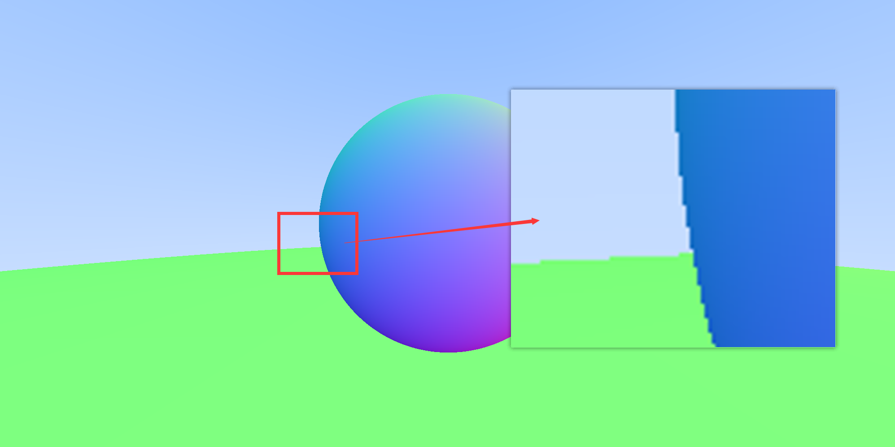

$$spp=1,time=4271ms$$

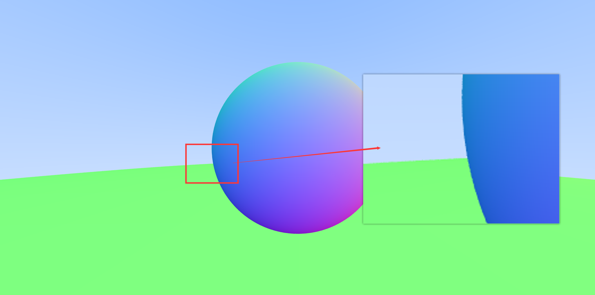

$$spp=16,time=59097ms$$

可以看出，渲染时间几乎是以 **spp** 的倍数增长。后面测试就需要调低分辨率了，这里设置的都是 $2000\times 1000$ 。

### Chapter-07
本章实现了一下 **Diffuse** 的材质，这里实现的非常简洁，并且都没有涉及到光源，材质的颜色也没有涉及到，纯粹是通过判断光线与物体是否有交点，有就返回其多次弹射到背景上的颜色，并且每次弹射颜色都会衰减一半，这就会出现下图中的情况。

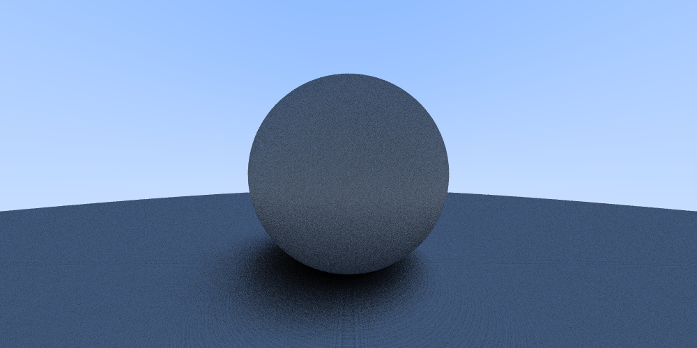

可以看到两球靠近的地方会更加容易使光线弹射多次，这就造成采样到的颜色值不断衰减，形成了阴影般的效果。

另外由于显示器都会默认颜色值是经过 **gamma矫正**的，但实际上我们获得的颜色值并未矫正，造成其效果会偏暗，但实际上我感觉生成出来也不像书上那么暗。为了以结果来证明，修改代码以矫正颜色，这里我采用的就是比较准确的伽马矫正，与书中有些微差别。

```cpp
void Renderer(const char* savePath) {
	// 参数设置
	int width = 1000, height = 500, channel = 3;
	Float gamma = 1.0 / 2.2;


	// 采样值，一个像素内采多少次样
	int spp = 4;
	Float invSpp = 1.0 / Float(spp);

	auto* data = (unsigned char*)malloc(width * height * channel);

	// 构建一个简单的相机
	Camera camera;

	// 搭建一个简单的场景
	vector<std::shared_ptr<Shape>> shapes;
	shapes.push_back(CreateSphereShape(Point3f(0, 0, -1), 0.5));
	shapes.push_back(CreateSphereShape(Point3f(0, -100.5, -1), 100));

	// 构建随机数
	// std::default_random_engine seeds;
	// seeds.seed(time(0));
	std::uniform_real_distribution<Float> randomNum(0, 1); // 左闭右闭区间


	std::shared_ptr<Shape> world = CreateShapeList(shapes);
	for (auto sy = height - 1; sy >= 0; sy--) {
		for (auto sx = 0; sx < width; sx++) {
			Point3f color;
			// 采样计算
			for (auto s = 0; s < spp; s++) {
				Float u = Float(sx + randomNum(seeds)) / Float(width);
				Float v = Float(height - sy - 1 + randomNum(seeds)) / Float(height);
				Ray ray = camera.GenerateRay(u, v);
				color += Color(ray, world);
			}
			color *= invSpp; // 求平均值
			color = Point3f(pow(color.x, gamma), pow(color.y, gamma), pow(color.z, gamma)); // gamma矫正
			int ir = int(255.99 * color[0]);
			int ig = int(255.99 * color[1]);
			int ib = int(255.99 * color[2]);

			int shadingPoint = (sy * width + sx) * 3;
			data[shadingPoint] = ir;
			data[shadingPoint + 1] = ig;
			data[shadingPoint + 2] = ib;
		}
	}
	// 写入图像
	stbi_write_png(savePath, width, height, channel, data, 0);
	cout << "渲染完成！" << endl;
	stbi_image_free(data);
}
```

确实要亮些了，果然什么都得实践！！！

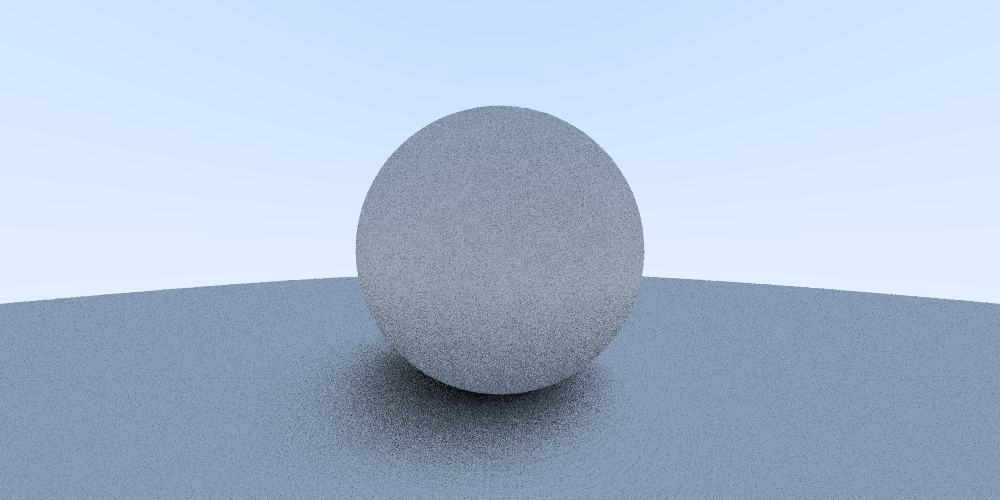


### Chapter-08
本节主要实现了金属材质的模拟，这里主要去把金属当作镜子来理解。不同材质的实现主要靠改变反射光的分布。因此光线击中金属表面后反射的光近似于镜面反射，因此在材质中实现了 **Reflect** 方法。此外并不是所有金属表面都是纯镜面反射的，因此添加了一个参数 $fuzz$ 用来扰动反射光，达到那种反射情况介于镜面反射和漫反射之间的材质，我们称为 **Glossy material**。它不是完全的镜子，比镜子粗糙一些，就像铜镜。

---

这里给自己提个醒，看来C++掌握的还不太熟练，头文件的引用造成在写这一节的代码的时候出现了很多低级错误。不过这也算是一个学习的过程，知难而上😆，主要结合了pbrt的代码来写的，并不完全是照着这本书来写。另一个需要注意的是**随机数**的使用，切记要使用同一分布的随机数，不然出来的图片噪音很明显，且分布很不自然。

---

接下来就该展现成果图了，虽然渲染时间长一点，但还是会花久一点得到更好看的结果来奖励自己。。。

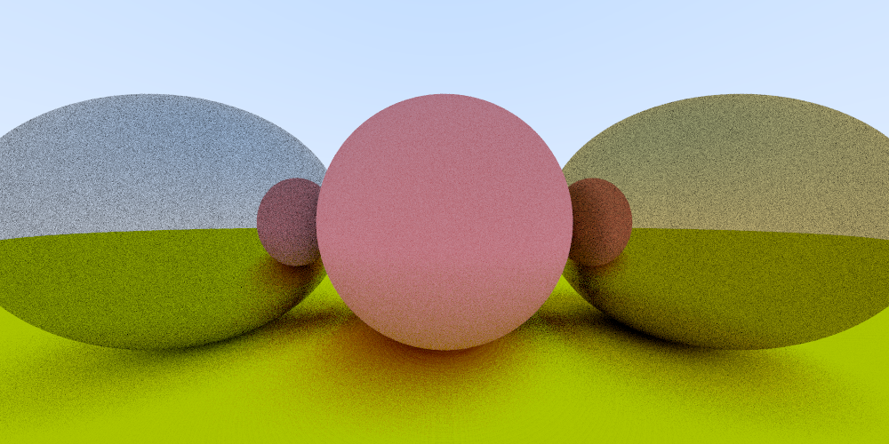

上图的 $spp=16, size=1000\times500$，感觉噪声有点明显，这是还没实现 $fuzz$ 的效果，中间漫反射，左右两个球镜面反射。


上图的 $spp=100, size=600\times300$，感觉稍微好些了，但是这种采样率感觉效果不太对，给我感觉应该还是随机数的问题。


上图的 $spp=1000, size=600\times300$，随着采样率的提高，整体噪点变少了，但是图像感觉也变模糊了，因为采样越多，后面对颜色的处理其实类似于图像中的均值模糊了。

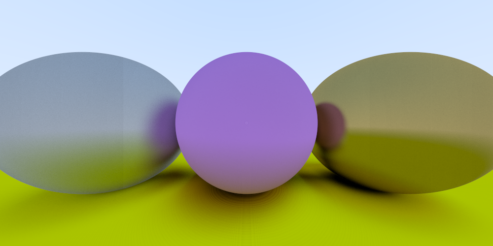

上图的 $spp=1000, size=1000\times500$，这个是加入了 $fuzz$ 的效果，确实有 **铜镜** 那味了，但是看细节可以发现图像两边有那种噪点过渡的边界，感觉很奇怪，原因大抵是随机数或者数值精度的毛病。

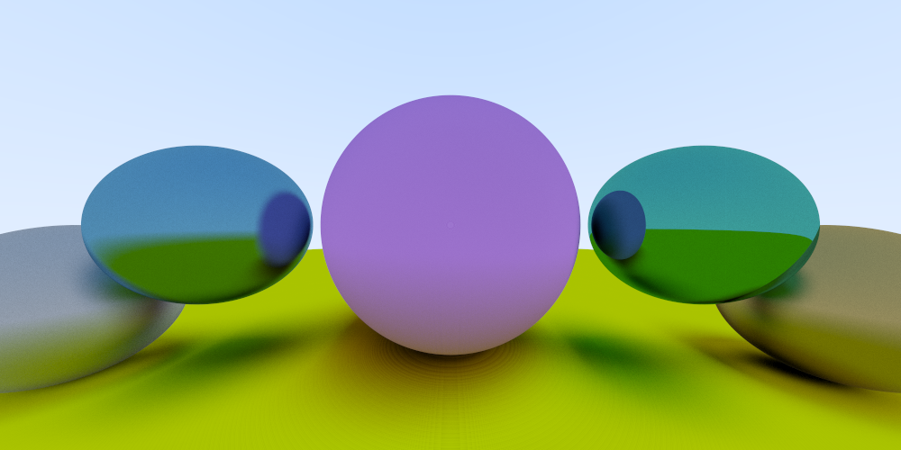

上图的 $spp=1000, size=1000\times500$，展示了不同 $fuzz$ 值的效果。


### Chapter-09

解决前面留下的一个问题，**精度问题**，在判断是否击中的时候，由于计算机中的浮点值具有浮点误差，导致有些可以击中的点被判断为没击中，因此改动了一下代码：

```cpp
// 判断有根与否并求根，取小的根作为击中点所需要的时间(可以把t抽象成时间)
// ShadowEpsilon = 0.0001
if (discriminant > 0) {
	Float invA = 1.0 / (2.0 * a);
	Float temp = (-b - sqrt(discriminant)) * invA;
	if (temp < ShadowEpsilon) {
		temp = (-b + sqrt(discriminant)) * invA;
	}
	if (temp < ray.tMax && temp > ShadowEpsilon) {
		rec.t = temp;
		rec.p = ray(temp);
		rec.normal = Normal3f((rec.p - center) * invRadius);
		rec.mat = material;
		return true;
	}
}
```

成像差别：

(1) 未修改

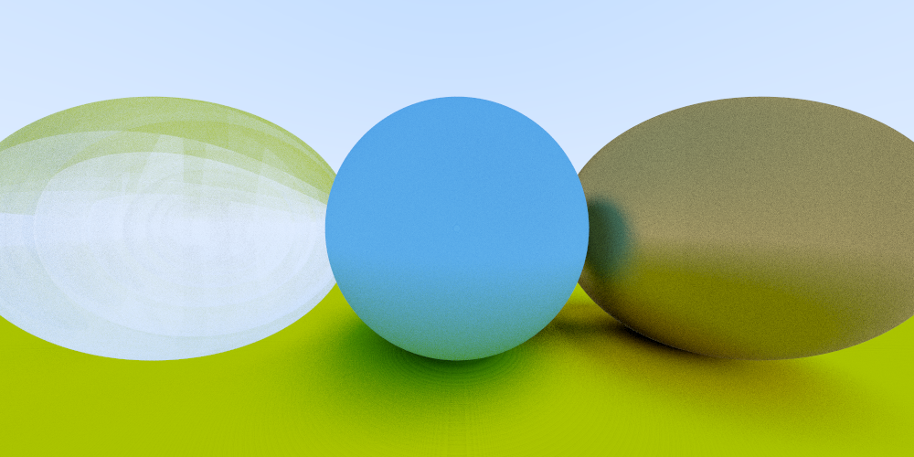

(2) 第一次修改后

-1000x500.png)

巨难受。。。左边这个球的黑边就是作者出现的那种效果，我真的是服了，花了半个下午的时间才发现作者在实现折射函数时里面有个问题。一切尽在注释中，我还回头看了一下作者实现Vec3的代码，他归一化时返回的是一个新向量，并没有改变原来的向量，因此这里确实会造成错误。

```cpp
inline bool Refract(const Vector3f& v, const Vector3f& n, Float niOverNo, Vector3f& refracted){
	Vector3f uv = Normalize(v);
	Float dt = Dot(uv, n);
	// 这里主要是判断能不能折射出来
	Float discriminant = 1.0 - niOverNo * niOverNo * (1 - dt * dt);
	if (discriminant > 0) {
		// 这里应该是（uv - n * dt）
		// 错误：（这里的 v 没有归一化）refracted = niOverNo * (v - n * dt) - n * sqrt(discriminant);
		refracted = niOverNo * (uv - n * dt) - n * sqrt(discriminant);
		return true;
	}
	return false;
}
```

(3) 第二次修改后

-1000x500.png)

痛，太痛了，伊苏尔德😭！！！

**实现另一个性质**，比方说我们看窗子，视角越垂直表面，就越透明，越靠经边边角角就有镜子的效果，眼镜也是这样。

**实现Schlick的近似公式**
(1) 一个玻璃球

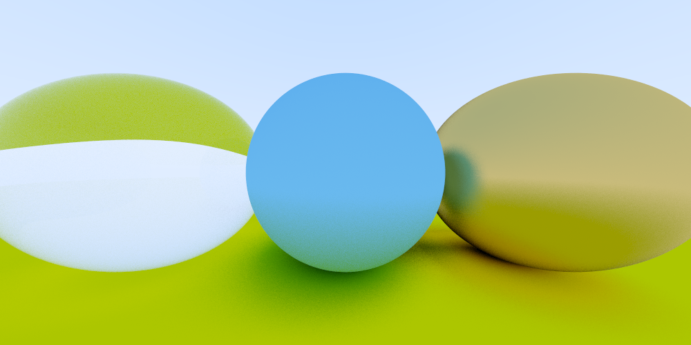

(2) 一个玻璃球里面再放一个玻璃球，但是里面那个设置的半径是负数，这会使得其生成的法线朝球体内部，这个效果就相当于是一个中空的玻璃球。

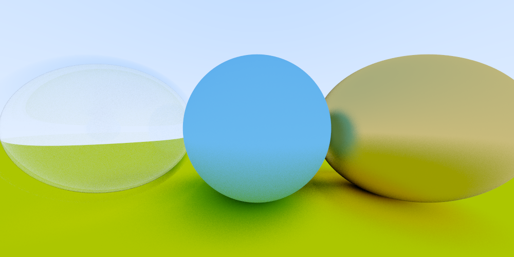

(3) 尝试一下在中空的玻璃球里再放一个球

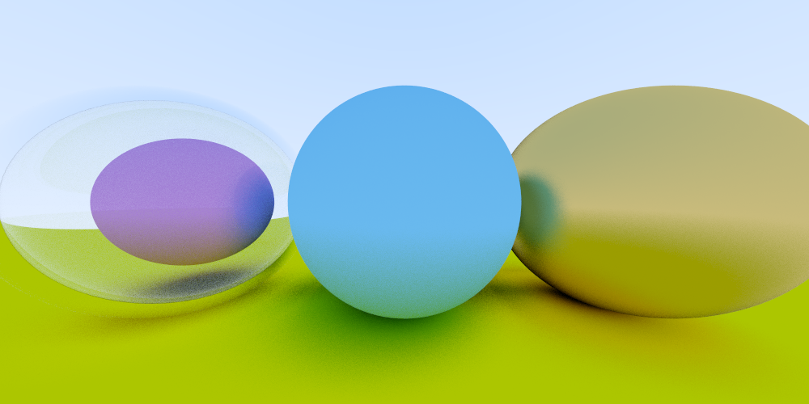

<center> 磨砂材质球 </center>

   


<center> 金属材质球 </center>

**折射原理以及公式推导：**

首先看图，我仿照原书画的：

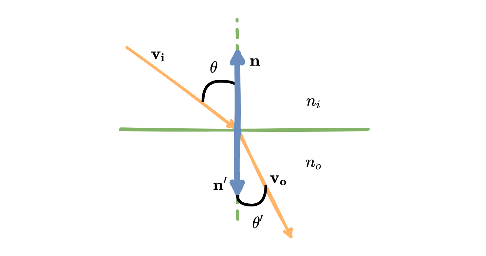

$\mathbf{n,n'}$ 是不同方向的法线向量且都做了归一化处理；
$\mathbf{v_i,v_o}$ 分别是入射向量和折射向量，且都是单位向量；
$\mathbf{\theta,\theta'}$ 分别是两面的夹角；
$\mathbf{n_i,n_o}$ 是不同面的折射率；

了解了基本概念后，我们需要求解的是 $\mathbf{v_o}$

首先是 **Snell** 公式:

$$
\begin{aligned}
n_i\sin\theta=n_o\sin\theta' 
\end{aligned}
$$

先判断是否能够折射出去，因为你想，如果从折射率大的一面折射出去，当夹角 $\theta$ 很大的时候，比如 $\theta=90, n_i=1.5,n_o=1.0$，那么要想满足上式则 $\sin\theta' > 1$ 才行，这显然是不可能的，故这里当出现这种情况的时候将不产生折射，而是反射全部光线，这种现象叫做**全反射**。 

如何判断呢？
$$
\begin{aligned}
\sin^2\theta' &= \left(\frac{n_i}{n_o}\right)^2\sin^2\theta \\
&=\left(\frac{n_i}{n_o}\right)^2(1-\cos^2\theta) < 1.0
\end{aligned}
$$

对应代码就是：
```cpp
Float dt = Dot(uv, n); // cosθ < 0
// 这里主要是判断能不能折射出来
Float discriminant = 1.0 - niOverNo * niOverNo * (1 - dt * dt);
if (discriminant > 0) {
	// To do...
}
```

接下来判断完就可以去求解 $\mathbf{v_o}$
如下图：

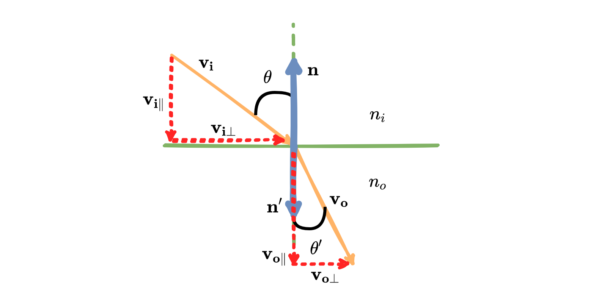

我们可以将 $\mathbf{v_i,v_o}$ 分解
$$
\mathbf{v_i} = \mathbf{v_{i\|}} + \mathbf{v_{i\perp}} \\
\mathbf{v_o} = \mathbf{v_{o\|}} + \mathbf{v_{o\perp}} \\
$$
其中
$$
\begin{aligned}
\mathbf{v_{i\|}} &= (\mathbf{v_i}\cdot (\mathbf{-n}))(\mathbf{-n})\\
&= (|\mathbf{v_i}||\mathbf{\mathbf{-n}}|\cos\theta)(\mathbf{-n}) \\
&= -\cos\theta(\mathbf{n})
\end{aligned}
$$
同理
$$
\begin{aligned}
\mathbf{v_{o\|}} = \cos\theta'(\mathbf{n'})
\end{aligned}
$$
解析 $\mathbf{v_{i\perp}}$
$$
\begin{aligned}
\sin\theta = \frac{|\mathbf{v_{i\perp}}|}{|\mathbf{v_i}|} = |\mathbf{v_{i\perp}}|, \\
\sin\theta' = \frac{|\mathbf{v_{o\perp}}|}{|\mathbf{v_o}|} = |\mathbf{v_{o\perp}}|,
\end{aligned}
$$

注意，这里 $\mathbf{v_{i\perp}},\mathbf{v_{o\perp}}$ 的方向相同，故

$$
\begin{aligned}
\frac{\mathbf{v_{i\perp}}}{|\mathbf{v_{i\perp}}|} = 
\frac{\mathbf{v_{o\perp}}}{|\mathbf{v_{o\perp}}|}
\end{aligned}
$$

由上式可得：

$$
\begin{aligned}
\mathbf{v_{o\perp}} &= \frac{{|\mathbf{v_{o\perp}}|}}{|\mathbf{v_{i\perp}}|}\mathbf{v_{i\perp}} 
= \frac{\sin\theta'}{\sin\theta}\mathbf{v_{i\perp}} = \frac{n_i}{n_o} \mathbf{v_{i\perp}} = 
\frac{n_i}{n_o} (\mathbf{v_{i}}+ |\mathbf{v_{i}}|\cos\theta(\mathbf{n})) \\
\mathbf{v_{o\|}} &= \cos\theta'(\mathbf{n'}) = -\cos\theta'(\mathbf{n}) = - \sqrt{1-\sin^2\theta'}(\mathbf{n}) = -\sqrt{1-|\mathbf{v_{o\perp}}|^2}(\mathbf{n})
\end{aligned}
$$

最终：
$$
\begin{aligned}
\mathbf{v_o} &= \mathbf{v_{o\|}} + \mathbf{v_{o\perp}} \\
&= \frac{n_i}{n_o} (\mathbf{v_{i}}+ \cos\theta(\mathbf{n})) - \sqrt{1-|\mathbf{v_{o\perp}}|^2}(\mathbf{n})
\end{aligned}
$$

对应代码:
```cpp
// cos(theta) < 0，因为没有点乘 -n，但是并不影响
// 只有下式中 (uv - n * dt) 本来推导式应该是 (uv + n * dt) 
refracted = niOverNo * (uv - n * dt) - n * sqrt(discriminant);
```

其次真实的玻璃反射率会随着视角变化，其实就是**菲涅尔反射**效应，因此还需要用一个公式来获得真实的效果，但原始方程太复杂了（菲涅尔公式），这里采用的是 Christophe Schlick 使用多项式近似简化过的方程：
$$
F(F_0,\theta_i) = F_0+(1-F_0)(1-\cos\theta_i)^5, \\
F_0=\left(\frac{n_i - n_o}{n_i + n_o}\right)^2
=\left(\frac{\frac{n_i}{n_o} - 1}{\frac{n_i}{n_o} + 1}\right)^2
$$

代码：
```cpp
inline Float Schlick(Float cosine, Float refIdx) {
	Float r0 = (1 - refIdx) / (1 + refIdx);
	r0 *= r0;
	return r0 + (1 - r0) * pow((1 - cosine), 5);
}
```

到此整个推导就结束了，不仅要得到效果，还要了解背后的原理，前路漫漫啊，还好头发多🤡