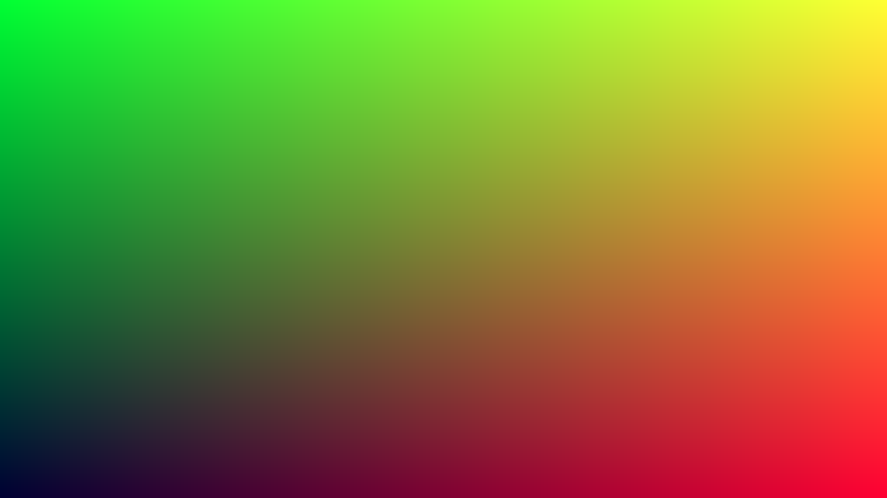

# GraphicsEngine
The implementation of "RayTracing, RealTime Rendering, Rasterization Rendering" 

## Implementation of 《Ray Tracing In One Weekend》
### Chapter-01

---
使用了一个图像处理库，"stb_image_write.h",
大概操作如下：
```cpp
// 申请一块连续的内存用来存储像素
auto* data = (unsigned char*)malloc(width * height * channel);

// To do...

// 写入图像
stbi_write_png("output-chapter01.png", width, height, channel, data, 0);

// 释放内存
stbi_image_free(data);
```
### Chapter-02
这一章节主要是构建一些基元用以构建整个图形学的世界，主要就是向量类，这里我没有根据 **Ray Tracing In One Weekend** 的思想来，而是直接迁移了 **PBRT** 一书中有关 **Vector, Point, Normal** 的实现，具体可参见 [pbrt.org](https://www.pbrt.org/)

相比于上一章，主要是用 Vector 来承载RGB颜色并输出。


### Chapter-03
设计一个简单的光线类(Ray)，同时用简单的方式来测试光线的值，转化为一种简便的颜色，可以用来当作背景。这里因为看过pbrt，再加上后面也会以此为基础添加更多的功能，因此直接将pbrt中的光线类代码搬了过来使用。毕竟有更好的轮胎🤣

使用不同分量来插值以得到不同的视觉感受
```cpp
// Chapter03 : simple color function
Point3f Color(const Ray& ray) {
	Vector3f dir = Normalize(ray.d);
	Float t = 0.5 * (dir.y + 1.0);
	return Lerp(t, Point3f(1.0, 1.0, 1.0), Point3f(0.5, 0.7, 1.0));
}
```

我分别测试了三种分量来获得不同的效果。
$$t=0.5\times(\mathbf{dir}_y + 1.0) \tag{3-1}$$
 

$$t=0.25\times(\mathbf{dir}_x + 2.0) \tag{3-2}$$
 

 $$t=\mathbf{dir}_z + 2.0 \tag{3-3}$$
 

至于 $t$ 为什么要这么计算，目的主要是为了将其区间映射至 $[0,1]$ .